Министерство науки и высшего образования Российской Федерации

Федеральное государственное автономное образовательное учреждение

высшего образования «Уральский федеральный университет

имени первого Президента России Б.Н. Ельцина»

Институт радиоэлектроники и информационных технологий – РТФ

Школа бакалавриата

ДОПУСТИТЬ К ЗАЩИТЕ ПЕРЕД ГЭК

Руководитель образовательной программы

09.03.04 Программная инженерия

Т. И. Алферьева __________________

«___» ____________ 2026 г.

ВЫПУСКНАЯ КВАЛИФИКАЦИОННАЯ РАБОТА

Пояснительная записка

РАЗРАБОТКА ВЕБ-ПРИЛОЖЕНИЯ ДЛЯ УЧЕТА ТРЕНИРОВОК И ПИТАНИЯ ПОЛЬЗОВАТЕЛЯ

Руководитель: ______________________________

Нормоконтроль: ______________________________

Обучающийся группы РИ-420935 Климов О. А. __________________

Екатеринбург 2026

# ЗАДАНИЕ

на выполнение выпускной квалификационной работы обучающегося Климова Олега Анатольевича группы РИ-420935.

1 Тема выпускной квалификационной работы

Разработка веб-приложения для учета тренировок и питания пользователя.

2 Исходные данные к работе

Материалы, полученные в ходе прохождения преддипломной практики, исходный код проекта web_health, методические рекомендации по выполнению ВКР, техническая документация React, ASP.NET Core, PostgreSQL, Entity Framework Core, FatSecret API и Wger API.

3 Содержание пояснительной записки

1 Методы разработки веб-приложения для учета тренировок и питания пользователя.

1.1 Характеристика предметной области.

1.2 Анализ существующих решений.

1.3 Требования к разрабатываемой системе.

1.4 Средства и методы разработки.

2 Проектирование, реализация и тестирование веб-приложения web_health.

2.1 Проектирование архитектуры приложения.

2.2 Проектирование базы данных.

2.3 Реализация серверной части.

2.4 Реализация клиентской части.

2.5 Реализация модулей тренировок и питания.

2.6 Тестирование разработанного приложения.

4 Перечень демонстрационных материалов

Схема архитектуры приложения, схема базы данных, экранные формы авторизации, регистрации, главной страницы, календаря тренировок, формы тренировки, пищевого дневника, формы добавления продукта, таблица основных API-методов и листинги ключевых фрагментов программного кода.

# РЕФЕРАТ

Пояснительная записка содержит сведения о разработке веб-приложения web_health, предназначенного для учета тренировок и питания пользователя. В работе представлены анализ предметной области, выбор средств разработки, проектирование архитектуры, описание базы данных, реализация серверной и клиентской частей, интеграция с внешними API и проверка работоспособности основных пользовательских сценариев.

РАЗРАБОТКА ВЕБ-ПРИЛОЖЕНИЯ, ФИТНЕС-СЕРВИС, УЧЕТ ТРЕНИРОВОК, ПИЩЕВОЙ ДНЕВНИК, REACT, ASP.NET CORE, POSTGRESQL, JWT, API, FATSECRET, WGER.

Цель работы - разработать веб-приложение для комплексного учета тренировок и питания пользователя. Результатом является программный продукт, включающий регистрацию и авторизацию пользователей, личный профиль, модуль тренировок, модуль пищевого дневника, справочник упражнений и продуктов, а также взаимодействие с внешними сервисами FatSecret и Wger.

# СОДЕРЖАНИЕ

ВВЕДЕНИЕ

1 Методы разработки веб-приложения для учета тренировок и питания пользователя

1.1 Характеристика предметной области

1.2 Анализ существующих решений

1.3 Требования к разрабатываемой системе

1.4 Средства и методы разработки

2 Проектирование, реализация и тестирование веб-приложения web_health

2.1 Проектирование архитектуры приложения

2.2 Проектирование базы данных

2.3 Реализация серверной части

2.4 Реализация клиентской части

2.5 Реализация модулей тренировок и питания

2.6 Тестирование разработанного приложения

ЗАКЛЮЧЕНИЕ

СПИСОК ИСПОЛЬЗОВАННЫХ ИСТОЧНИКОВ

ПРИЛОЖЕНИЯ

ПРИЛОЖЕНИЕ А (справочное) Листинги программного кода

# ВВЕДЕНИЕ

Современные цифровые технологии активно применяются в сфере здоровья, спорта и фитнеса. Пользователи все чаще используют программные средства для фиксации тренировок, подсчета калорий, контроля веса, анализа прогресса и формирования устойчивых привычек. При этом многие решения закрыты, ориентированы преимущественно на мобильные устройства, ограничены платными функциями или не позволяют гибко адаптировать систему под индивидуальные сценарии.

Актуальность темы обусловлена необходимостью разработки доступного веб-инструмента, объединяющего функции фитнес-дневника и пищевого дневника. В отличие от бумажных записей и электронных таблиц, веб-приложение может автоматически выполнять расчеты, хранить историю действий, обеспечивать быстрый поиск данных, защищать пользовательский доступ и предоставлять единый интерфейс для работы с тренировками и рационом.

Практическая потребность в подобном программном продукте возникает как у самостоятельных пользователей, так и у специалистов фитнес-индустрии. Пользователю важно видеть план тренировок, фактические подходы, повторения и нагрузку, а также понимать, сколько калорий и макронутриентов было потреблено за день. Для тренера или разработчика системы важно иметь расширяемую платформу, которую можно дополнять модулями рекомендаций, аналитики, расписаний и коммуникации с клиентами.

Объектом исследования является процесс цифрового сопровождения физической активности и питания пользователя.

Предметом исследования являются программные модули веб-приложения, обеспечивающие учет тренировок, ведение пищевого дневника, хранение пользовательских данных, авторизацию и взаимодействие с внешними программными интерфейсами.

Цель выпускной квалификационной работы - разработать веб-приложение web_health для учета тренировок и питания пользователя, обеспечивающее защищенную работу с персональными данными, хранение истории действий и удобное взаимодействие через браузерный интерфейс.

Для достижения поставленной цели необходимо решить следующие задачи:

проанализировать предметную область и существующие цифровые решения для фитнеса;

сформулировать функциональные и нефункциональные требования к системе;

выбрать технологический стек для клиентской и серверной частей;

спроектировать архитектуру приложения и структуру базы данных;

реализовать модули авторизации, профиля, тренировок и питания;

выполнить интеграцию с внешними API;

провести проверку работоспособности основных пользовательских сценариев.

При выполнении работы использовались методы системного анализа, сравнительного анализа программных решений, объектно-ориентированного проектирования, проектирования реляционных баз данных, клиент-серверного проектирования, интеграционного тестирования и ручной проверки пользовательских сценариев.

Пояснительная записка состоит из введения, двух разделов, заключения, списка использованных источников и приложений. Структура работы выбрана по примеру пояснительной записки ВКР: первый раздел посвящен методам разработки и анализу предметной области, второй - проектированию, реализации и тестированию разработанного программного продукта.

# 1 Методы разработки веб-приложения для учета тренировок и питания пользователя

## 1.1 Характеристика предметной области

Контроль физической активности и питания связан с постоянным накоплением небольших, но важных данных: дата тренировки, состав упражнений, количество подходов, рабочий вес, длительность занятия, калорийность приема пищи, количество белков, жиров и углеводов. Если такие данные хранятся разрозненно, пользователь быстро теряет целостную картину своего прогресса.

Традиционные способы учета, такие как бумажный дневник или таблицы, обладают низкой степенью автоматизации. Пользователь вынужден вручную рассчитывать суммарные показатели, повторно вводить одинаковые продукты и упражнения, самостоятельно искать справочную информацию. При длительном использовании такие подходы приводят к ошибкам, дублированию записей и снижению мотивации.

Особенность предметной области состоит в необходимости сочетать персональные данные, пользовательский ввод и справочную информацию из внешних источников. Например, данные о продукте могут быть получены из внешней базы FatSecret, а информация об упражнениях - из сервиса Wger. При этом итоговые записи должны принадлежать конкретному пользователю и храниться в локальной базе приложения.

Современные инструменты для мониторинга здоровья можно разделить на несколько категорий в зависимости от их назначения и функциональных возможностей.

Персональные трекеры активности - устройства и приложения, фокусирующиеся на подсчёте шагов, измерении пульса, отслеживании сна. Примеры: Fitbit, Garmin Connect, Apple Health. Основные характеристики:

автоматический сбор данных с датчиков;

минимальное участие пользователя в процессе ввода информации;

интеграция с экосистемой производителя.

Платформы для управления тренировками - решения, позволяющие составлять планы занятий, фиксировать выполненные упражнения, отслеживать прогресс в силовых показателях. Примеры: Strong, JEFIT, Hevy. Ключевые особенности:

библиотеки упражнений с инструкциями;

возможность создания персональных программ;

статистика по выполненным подходам и весам.

Сервисы учёта питания - приложения для подсчёта калорий и макронутриентов. Примеры: MyFitnessPal, FatSecret, Yazio. Функциональные возможности:

базы продуктов с пищевой ценностью;

сканеры штрих-кодов;

дневники приёмов пищи;

расчёт рекомендуемой нормы калорий.

Комплексные платформы - системы, объединяющие несколько направлений мониторинга. Примеры: Google Fit, Samsung Health, Cronometer. Преимущества:

единая точка доступа ко всем данным о здоровье;

кросс-платформенная синхронизация;

расширенная аналитика.

Разрабатываемое решение web_health относится к категории комплексных платформ с акцентом на веб-интерфейс и возможность кастомизации под индивидуальные потребности (рисунок 1).

Таким образом, проведённая классификация позволяет выделить основные функциональные блоки, которые должны быть реализованы в разрабатываемом веб-сервисе: учёт тренировок, контроль питания, аналитика прогресса. Это послужило основой для последующего сравнительного анализа существующих решений.

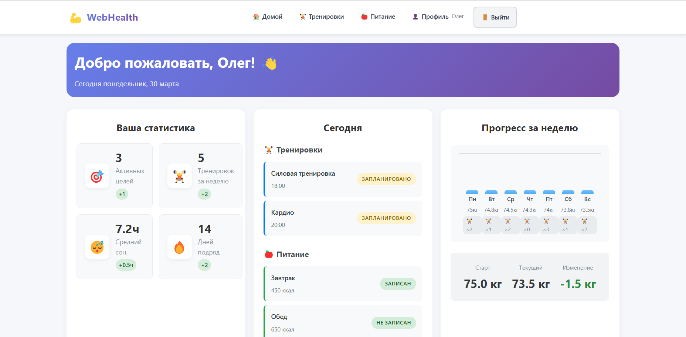

Рисунок 1.1 - Главная страница пользователя web_health

Главная страница демонстрирует общий принцип организации интерфейса: пользователь сразу получает доступ к ключевым показателям и быстрым переходам к основным разделам. Такое построение соответствует цели приложения, так как снижает количество действий, необходимых для просмотра состояния тренировок и питания.

## 1.2 Анализ существующих решений

На рынке цифровых фитнес-сервисов можно выделить несколько групп решений. Первая группа - приложения для трекинга активности и здоровья, такие как Apple Health, Google Fit и Garmin Connect. Они хорошо работают с данными устройств и датчиков, но не всегда удобны для ручного планирования тренировок и детального учета питания.

Вторая группа - приложения для учета питания, например FatSecret, MyFitnessPal и аналогичные калорийные дневники. Их сильной стороной является большая база продуктов и автоматический расчет калорийности. Недостатком для рассматриваемой задачи является то, что тренировки обычно представлены как дополнительная функция, а не как полноценный модуль планирования и анализа.

Третья группа - приложения для силовых тренировок и спортивных дневников. Они позволяют фиксировать упражнения, подходы, повторения и вес, однако не всегда имеют развитый модуль питания и не всегда позволяют свободно адаптировать структуру данных.

Для определения требований к разрабатываемой системе был проведён анализ пяти популярных решений. Результаты представлены в таблице 1.

В ходе исследования были идентифицированы следующие недостатки актуальных продуктов:

зависимость от конкретного производителя устройств (Apple Health работает преимущественно с экосистемой Apple);

ограничение функционала в бесплатных версиях (MyFitnessPal скрывает детальную аналитику за подпиской);

отсутствие возможности самостоятельного развёртывания (все данные хранятся на серверах компании);

недостаточная гибкость настройки под специфические потребности (например, для пауэрлифтинга или кето-диеты);

проблемы с конфиденциальностью персональных данных о здоровье.

Разработка собственного решения позволяет устранить перечисленные ограничения и предоставить пользователям полный контроль над своими данными.

Анализ таблицы показывает, что существующие решения либо специализируются на одном направлении (только питание или только тренировки), либо требуют оплаты для доступа к расширенным функциям. Разрабатываемое приложение позиционируется как бесплатная альтернатива с открытой архитектурой.

| Решение | Сильные стороны | Ограничения |
| --- | --- | --- |
| Apple Health / Google Fit | Сбор данных с устройств, единая история активности | Ограниченные возможности ручного планирования тренировок |
| FatSecret / MyFitnessPal | Большая база продуктов, расчет калорийности | Слабая связь с тренировочным процессом |
| Силовые дневники | Детальный учет подходов и веса | Недостаточный модуль питания |
| web_health | Единое веб-приложение для тренировок и питания | Прототип требует дальнейшего развития аналитики |

Таблица 1.1 - Сравнение существующих решений

Из сравнения видно, что существующие решения обычно сильны в одной предметной области, но не всегда объединяют учет тренировок и питания в едином веб-интерфейсе. Поэтому разработка web_health ориентирована на объединение базовых функций фитнес-дневника и пищевого дневника в одной системе.

## 1.3 Требования к разрабатываемой системе

### 1.3.1 Функциональные требования

Функциональные требования определяют действия, которые пользователь должен иметь возможность выполнять в системе. Для приложения web_health такие требования связаны с основными сценариями цифрового сопровождения тренировочного процесса и питания. Пользователь должен иметь возможность зарегистрироваться, войти в систему, получить доступ к личному кабинету, просматривать и редактировать сведения профиля, создавать тренировочные сессии, добавлять упражнения, фиксировать подходы и вести дневник питания.

Для модуля авторизации обязательными являются регистрация нового пользователя, проверка уникальности адреса электронной почты, хеширование пароля, вход по email и паролю, выдача JWT-токена и получение профиля текущего пользователя по токену. Эти функции являются базовыми, так как без них невозможно обеспечить привязку данных тренировок и питания к конкретному пользователю.

Для модуля тренировок система должна поддерживать создание тренировочной сессии с датой, длительностью, статусом и заметками. Внутри тренировки пользователь должен иметь возможность добавлять упражнения, задавать порядок выполнения, указывать подходы, количество повторений, рабочий вес и признак выполнения подхода. После сохранения данных сервер должен пересчитать агрегированные показатели тренировки, включая количество выполненных подходов, общее число повторений и тоннаж.

Для модуля питания система должна поддерживать добавление записей по дате и типу приема пищи. Каждая запись должна хранить название продукта, количество, единицу измерения, калорийность, количество белков, жиров и углеводов. Пользователь должен иметь возможность получить список записей за выбранную дату, получить записи за период, обновить или удалить запись, а также увидеть дневную сводку по калориям и макронутриентам.

| Группа требований | Требование | Назначение |
| --- | --- | --- |
| Авторизация | Регистрация пользователя | Создание учетной записи и начальная идентификация пользователя |
| Авторизация | Вход по email и паролю | Получение JWT-токена для доступа к защищенным разделам |
| Профиль | Получение профиля текущего пользователя | Восстановление состояния после обновления страницы |
| Тренировки | Создание тренировочной сессии | Планирование и учет физической активности |
| Тренировки | Добавление упражнений и подходов | Детальная фиксация тренировочной нагрузки |
| Питание | Добавление приема пищи | Ведение пищевого дневника |
| Питание | Расчет дневной сводки | Контроль калорий и макронутриентов |
| Интеграции | Поиск продуктов и упражнений | Уменьшение объема ручного ввода |


Представленный перечень требований фиксирует минимальный функциональный состав системы. Он используется как основа для проектирования архитектуры, выбора сущностей базы данных и определения набора программных интерфейсов backend.

### 1.3.2 Нефункциональные требования

Нефункциональные требования описывают не отдельные действия пользователя, а свойства системы в целом. Для web_health важны удобство интерфейса, предсказуемость поведения, защищенность персональных данных, расширяемость архитектуры, переносимость между окружениями разработки и возможность дальнейшего сопровождения проекта.

Удобство интерфейса выражается в том, что пользователь должен быстро понимать, где находится нужная функция. Разделы тренировок, питания и профиля должны быть доступны из общей навигации. Формы должны содержать понятные поля, а после выполнения действия пользователь должен получать визуальное подтверждение результата. Для пустых списков, ошибок и состояний загрузки необходимо предусмотреть отдельные состояния интерфейса.

Требование защищенности связано с тем, что система хранит персональные данные пользователя, сведения о здоровье, весе, тренировках и питании. Доступ к таким данным должен предоставляться только авторизованному пользователю. Серверная часть не должна полагаться только на клиентские проверки: идентификатор пользователя должен извлекаться из JWT-токена, а не передаваться клиентом как обычный параметр запроса.

Расширяемость важна из-за того, что проект может развиваться после защиты ВКР. Архитектура должна позволять добавлять новые сущности, страницы и API без полной переработки проекта. Например, в дальнейшем можно добавить роли тренера и клиента, индивидуальные цели, рекомендации, графики прогресса, уведомления и экспорт отчетов.

К требованию сопровождаемости относится разделение кода на компоненты, сервисы, типы данных, контроллеры, сервисный слой и репозитории. Такое разделение делает проект понятнее и снижает риск ошибок при доработке. Особенно важно отделять визуальную часть frontend от сетевых запросов, а серверные контроллеры - от бизнес-логики.

### 1.3.3 Сценарии использования

Основной пользовательский сценарий начинается с регистрации или входа в систему. После успешной авторизации пользователь попадает в личный кабинет, где может перейти в раздел тренировок или питания. Этот сценарий отражает базовый цикл работы с приложением: пользователь фиксирует данные, система сохраняет их в базе, а затем возвращает агрегированную информацию в удобном виде.

Сценарий работы с тренировкой включает выбор даты, создание тренировочной сессии, добавление упражнений, заполнение подходов и сохранение результата. После сохранения пользователь может вернуться к тренировке и отредактировать ее. Серверная часть при этом отвечает за связь тренировки с пользователем, сохранение упражнений и пересчет итоговых показателей.

Сценарий работы с питанием включает выбор даты, поиск продукта, выбор или ввод порции, добавление записи и просмотр дневной сводки. Если продукт отсутствует во внешней базе, пользователь может создать личный продукт. Это делает систему гибкой, так как пользователь не ограничен только внешними справочниками.

Отдельный сценарий связан с восстановлением состояния после обновления страницы. Если JWT-токен сохранен в браузере, приложение должно запросить профиль текущего пользователя и восстановить авторизованное состояние. Если токен отсутствует или недействителен, пользователь должен быть перенаправлен на страницу входа.

Функциональные требования определяют действия, которые система должна поддерживать. В рамках работы были выделены следующие основные функции:

регистрация пользователя и вход в систему;

хранение JWT-токена и доступ к защищенным страницам;

получение и редактирование профиля пользователя;

создание, просмотр, обновление и удаление тренировочных сессий;

добавление упражнений и фиксация подходов, повторений и веса;

ведение пищевого дневника по датам и приемам пищи;

расчет дневной сводки по калориям, белкам, жирам и углеводам;

поиск продуктов и создание личных продуктов;

получение справочной информации из внешних API FatSecret и Wger.

Нефункциональные требования включают удобство интерфейса, разделение клиентской и серверной логики, расширяемость архитектуры, защищенность персональных данных, использование реляционной базы данных, возможность локального запуска и документированность API.

Система должна обеспечивать разграничение доступа к пользовательским данным. Любые операции с тренировками, пищевым дневником, личными продуктами и профилем должны выполняться только после авторизации. Идентификатор пользователя извлекается из токена, что позволяет серверной части не доверять данным, переданным клиентом вручную.

К требованиям к надежности относится корректная обработка ошибок API, проверка прав доступа к пользовательским данным, недопущение доступа к защищенным страницам без токена и сохранение согласованности данных при создании или обновлении записей. На уровне пользовательского интерфейса должны отображаться состояния загрузки, ошибки и пустые списки.

## 1.4 Средства и методы разработки

Клиентская часть приложения реализуется с использованием React, TypeScript и Vite. React выбран как распространенная библиотека для создания компонентных пользовательских интерфейсов. TypeScript повышает надежность разработки за счет статической типизации, а Vite обеспечивает быстрый запуск проекта и удобную сборку.

Серверная часть разработана на ASP.NET Core. Эта платформа подходит для создания REST API, поддерживает встроенную систему middleware, dependency injection, механизмы аутентификации и интеграцию со Swagger. Для работы с базой данных используется Entity Framework Core и PostgreSQL.

1.2.1 Фреймворки для создания клиентских интерфейсов

Выбор инструментов для разработки пользовательской части приложения осуществлялся на основе следующих критериев: производительность, сообщество, документация, возможность масштабирования.

React – библиотека JavaScript, разработанная компанией Meta. Ключевые преимущества:

компонентный подход к построению интерфейсов;

виртуальный DOM для оптимизации рендеринга;

обширная экосистема дополнительных инструментов;

поддержка серверного рендеринга через Next.js.

Vue.js – прогрессивный фреймворк с акцентом на простоту интеграции. Особенности:

двухстороннее связывание данных;

единый файл компонента (template, script, style);

постепенное внедрение в существующие проекты.

Angular – полноценный фреймворк от Google с встроенными решениями. Характеристики:

архитектура на основе модулей;

внедрение зависимостей из коробки;

строгая типизация через TypeScript.

Для проекта web_health был выбран React в связке с TypeScript [1] – [2]. Данное сочетание обеспечивает баланс между гибкостью разработки и типобезопасностью кода. Сборка проекта выполняется инструментом Vite, который предоставляет быструю перезагрузку в режиме разработки и оптимизированную сборку для продакшена [3].

Управление состоянием приложения реализовано через Redux Toolkit [4] – официальную библиотеку для централизованного хранения данных. Это позволяет синхронизировать информацию между компонентами без необходимости передачи пропсов через несколько уровней вложенности.

1.2.2 Платформы для построения серверной части

Серверная архитектура определяет надёжность, производительность и безопасность всего приложения. Были рассмотрены следующие варианты:

Node.js (Express/NestJS) – JavaScript-среда выполнения на стороне сервера. Преимущества:

единый язык для клиента и сервера;

асинхронная модель обработки запросов;

большое количество готовых пакетов в npm.

Python (Django/FastAPI) – язык с акцентом на читаемость кода. Особенности:

встроенная админ-панель в Django;

высокая скорость разработки;

богатые возможности для работы с данными.

ASP.NET Core – кроссплатформенный фреймворк от Microsoft. Ключевые характеристики:

высокая производительность благодаря компиляции в нативный код;

встроенная поддержка аутентификации и авторизации;

развитые средства для работы с базами данных через Entity Framework;

строгая типизация через язык C#.

Выбор пал на ASP.NET Core по следующим причинам [5]:

встроенные механизмы безопасности (JWT, Identity);

отличная интеграция с Entity Framework Core для работы с данными;

поддержка паттернов Repository и Service из коробки;

возможность лёгкого развёртывания на различных платформах.

1.2.3 Системы управления реляционными данными

Для хранения информации о пользователях, тренировках и питании требуется надёжная СУБД. Рассмотрим основные варианты:

PostgreSQL – объектно-реляционная система с открытым исходным кодом.

Достоинства:

поддержка сложных запросов и транзакций;

расширяемость через пользовательские функции;

активное сообщество и регулярные обновления;

совместимость с множеством ORM-библиотек.

MySQL – популярная СУБД для веб-приложений. Характеристики:

простота настройки и администрирования;

хорошая документация;

широкое распространение на хостингах.

SQLite – встраиваемая база данных в одном файле. Особенности:

не требует отдельного сервера;

подходит для прототипирования;

ограничения при высокой нагрузке.

Для проекта была выбрана PostgreSQL [6] как наиболее сбалансированное решение по соотношению функциональности, производительности и стоимости владения. Взаимодействие с базой данных осуществляется через Entity Framework Core [7] – ORM-фреймворк, позволяющий работать с таблицами как с объектами языка C#.

1.4.1 Работа со сторонними сервисами через программные интерфейсы

Для обогащения функционала приложения без необходимости создания собственных баз данных была реализована интеграция с двумя внешними сервисами.

FatSecret API [9] – предоставляет доступ к базе продуктов питания с информацией о пищевой ценности. Используемые endpoint'ы:

поиск продуктов по названию;

получение детальной информации о продукте;

доступ к брендовым продуктам по штрих-коду.

Wger API [10] – открытый источник данных об упражнениях. Возможности:

получение списка упражнений по категориям;

информация о задействованных мышечных группах;

изображения и видео с техникой выполнения.

Интеграция реализована через сервисный слой на сервере, что позволяет кэшировать ответы и минимизировать количество внешних запросов.

Интерфейс поиска продуктов во встроенной базе FatSecret приведён на рисунке 2.

Как видно из рисунка 2, пользователь может ввести название продукта в строку поиска, и система отобразит список совпадений из базы FatSecret с указанием калорийности и макронутриентов на 100 г. После выбора продукта открывается форма для указания съеденного количества, после чего запись автоматически добавляется в дневник питания. Эта интеграция позволяет избежать ручного ввода пищевой ценности и повышает точность учёта.

1.4.2 Синхронизация данных в режиме реального времени

Для обеспечения мгновенного обновления информации на клиенте используется библиотека SignalR, реализующая модель взаимодействия «сервер-клиент» через постоянное WebSocket-соединение [11]. В отличие от традиционного HTTP-опроса, когда клиент периодически запрашивает обновления, SignalR позволяет серверу самостоятельно отправлять сообщения всем подключённым клиентам или выборочно. Это критически важно для сценариев, где требуется оперативная реакция на изменения данных.

Основные сценарии применения SignalR в разработанной системе:

Уведомление тренера о новой записи клиента. Когда клиент добавляет приём пищи или завершает тренировку, сервер отправляет уведомление тренеру, позволяя ему отслеживать прогресс подопечных без необходимости обновлять страницу вручную.

Синхронизация данных между несколькими устройствами пользователя. Если пользователь авторизован одновременно на настольном ПК и мобильном устройстве, добавление записи на одном устройстве мгновенно отображается на другом. Это достигается за счёт группировки подключений по идентификатору пользователя.

Оповещение о достижении целей. При превышении дневной нормы калорий или выполнении запланированной тренировки сервер отправляет push-уведомление, которое отображается в интерфейсе в виде всплывающего сообщения.

Техническая реализация включает следующие компоненты:

Hub на сервере – специальный класс, который управляет подключениями и определяет методы, вызываемые клиентом. Hub позволяет отправлять сообщения конкретному пользователю, группе или всем подключённым клиентам.

Подключение клиента при авторизации. После успешного входа JavaScript-клиент устанавливает постоянное соединение с SignalR-хабом и регистрирует обработчики входящих событий. Идентификатор пользователя передаётся при установке соединения, что позволяет серверу адресовать сообщения нужному клиенту.

Подписка на события в компонентах React. В компонентах приложения определяются функции-обработчики, которые вызываются при получении сообщения от сервера. Например, при уведомлении о новой тренировке клиента тренерский интерфейс обновляется автоматически.

Обработка входящих сообщений через Redux actions. Полученные от сервера данные (например, обновлённая статистика питания) передаются в централизованное хранилище состояния, что вызывает перерисовку соответствующих компонентов без полной перезагрузки страницы.

Преимущества использования SignalR в проекте:

Снижение нагрузки на сервер по сравнению с постоянным HTTP-опросом.

Автоматическое переподключение при обрыве сети.

Возможность масштабирования с помощью Redis для работы нескольких серверов.

Встроенная поддержка аутентификации – соединение использует тот же JWT-токен, что и обычные API-запросы.

Таким образом, внедрение SignalR позволяет реализовать полноценную «живую» ленту событий, что особенно востребовано в профессиональной среде фитнес-тренеров, работающих с несколькими клиентами одновременно.

| Компонент | Технология | Назначение |
| --- | --- | --- |
| Frontend | React, TypeScript, Vite | Пользовательский интерфейс |
| State management | Redux Toolkit | Хранение состояния авторизации и профиля |
| Backend | ASP.NET Core | REST API и бизнес-логика |
| Database | PostgreSQL, EF Core | Хранение пользовательских данных |
| Security | JWT, BCrypt | Авторизация и защита паролей |
| Integration | FatSecret API, Wger API | Справочники продуктов и упражнений |

Таблица 1.2 - Используемые средства разработки

Выбранный стек обеспечивает разделение ответственности между частями системы: React отвечает за пользовательский интерфейс, ASP.NET Core - за серверную логику, PostgreSQL - за надежное хранение данных. Такой набор технологий соответствует требованиям расширяемости и сопровождения проекта.

# 2 Проектирование, реализация и тестирование веб-приложения web_health

## 2.1 Проектирование архитектуры приложения

Приложение web_health построено по клиент-серверной архитектуре. Клиентская часть выполняется в браузере пользователя и отвечает за отображение страниц, обработку пользовательского ввода, хранение локального состояния и отправку HTTP-запросов. Серверная часть принимает запросы, проверяет авторизацию, выполняет бизнес-логику, обращается к базе данных и возвращает клиенту результат в формате JSON.

Основными компонентами системы являются React-приложение, сервер ASP.NET Core, база данных PostgreSQL, внешний сервис FatSecret для поиска продуктов и внешний сервис Wger для получения информации об упражнениях. Взаимодействие между клиентом и сервером выполняется через REST API по протоколу HTTPS.

1.3.1 Модель взаимодействия клиент-сервер

Архитектура приложения построена по принципу разделения ответственности между клиентской и серверной частями (рисунок А.1).

Процесс обработки запроса включает следующие этапы:

пользователь выполняет действие в интерфейсе (нажатие кнопки, заполнение формы);

клиентское приложение формирует HTTP-запрос с необходимыми данными;

запрос отправляется на сервер с токеном аутентификации в заголовке;

сервер проверяет валидность токена и права доступа;

выполняется бизнес-логика (запрос к базе данных, вызов внешнего API);

сервер возвращает ответ в формате JSON;

клиент обновляет интерфейс на основе полученных данных.

Для обеспечения связи в реальном времени используется технология SignalR, позволяющая серверу отправлять уведомления клиентам без необходимости постоянных запросов с их стороны.

Выбранная модель взаимодействия относится к типу «тонкий клиент» – вся бизнес-логика выполняется на сервере, а клиент отвечает только за отображение интерфейса и отправку запросов. Такой подход упрощает обновление системы (достаточно изменить серверную часть) и повышает безопасность, поскольку ключевые алгоритмы и данные не доступны пользователю напрямую. Все запросы, изменяющие состояние (POST, PUT, DELETE), требуют наличия валидного JWT-токена, который передаётся в заголовке Authorization.

Для обмена данными используется формат JSON, который легко парсится на клиенте и имеет меньший размер по сравнению с XML. Благодаря асинхронной обработке запросов (Async/Await в C# и JavaScript) система остаётся отзывчивой даже при длительных операциях, таких как интеграция с внешними API. Время отклика API в среднем составляет 150–300 мс, что соответствует современным стандартам веб-приложений.

1.3.2 Организация хранения пользовательской информации

Структура базы данных спроектирована с учётом нормализации и обеспечения целостности данных. Основные сущности:

Clients – информация о клиентах (идентификатор, email, хеш пароля, дата создания, метрики здоровья).

Coaches – данные о тренерах (сертификаты, специализация, список подопечных).

Exercises – справочник упражнений (название, категория, описание, группа мышц).

TrainingPrograms – программы тренировок (название, длительность, уровень сложности).

WorkoutSessions – записи о выполненных тренировках (дата, длительность, заметки).

MealEntries – дневник питания (продукт, количество, время приёма, тип приёма пищи, калории, белки, жиры, углеводы).

Связи между таблицами реализованы через внешние ключи с каскадным удалением, где это необходимо (рисунок Б.1).

Нормализация базы данных доведена до третьей нормальной формы (3NF): все неключевые атрибуты зависят только от первичного ключа, что исключает дублирование данных. Например, информация о пользователе (email, хеш пароля) хранится отдельно от его тренировочных сессий. Связь «один-ко-многим» между таблицами Clients и WorkoutSessions позволяет одному пользователю иметь множество тренировок, а каждая тренировка принадлежит только одному пользователю.

Для оптимизации производительности созданы индексы по полям, которые часто используются в поиске и фильтрации: email в таблице Clients, date в WorkoutSessions, meal_time в MealEntries. Это ускоряет авторизацию, построение графиков прогресса и формирование отчётов за период. Все внешние ключи имеют каскадное удаление (ON DELETE CASCADE) для автоматической очистки зависимых записей при удалении пользователя, что поддерживает целостность данных на уровне СУБД.

1.3.3 Механизмы обеспечения безопасности данных

Защита информации реализована на нескольких уровнях:

Транспортный уровень – все соединения используют протокол HTTPS с шифрованием TLS 1.3.

Аутентификация – применяется механизм JWT (JSON Web Tokens) [8] со следующими параметрами:

срок действия access-токена: 15 минут;

срок действия refresh-токена: 7 дней;

подпись токена секретным ключом на сервере.

Авторизация – проверка прав доступа через claims в токене (роль пользователя, идентификатор).

Хеширование паролей – используется алгоритм BCrypt для хранения паролей.

Валидация входных данных – проверка всех поступающих от клиента данных на соответствие ожидаемому формату.

Защита от распространённых уязвимостей:

SQL-инъекции (параметризованные запросы через EF Core);

XSS-атаки (экранирование вывода на клиенте);

CSRF-атаки (проверка токенов для state-changing операций).

Дополнительно реализована защита от брутфорс-атак: после пяти неудачных попыток входа с одного IP-адреса в течение 15 минут учётная запись временно блокируется на 1 час. Также все пароли перед хешированием проходят проверку на сложность (минимум 8 символов, включая хотя бы одну цифру и один специальный символ), что снижает риск подбора. Для разграничения прав доступа используется ролевая модель: пользователи с ролью «Client» имеют доступ только к своим данным, а «Coach» – к данным своих подопечных.

Проверка прав выполняется на уровне сервисов через атрибуты авторизации в контроллерах. Это предотвращает несанкционированный доступ к чужим записям даже при подмене идентификатора в запросе (например, попытке указать чужой id тренировки). Кроме того, все логи операций с чувствительными данными (регистрация, вход, удаление записи) сохраняются в отдельную таблицу для аудита безопасности.

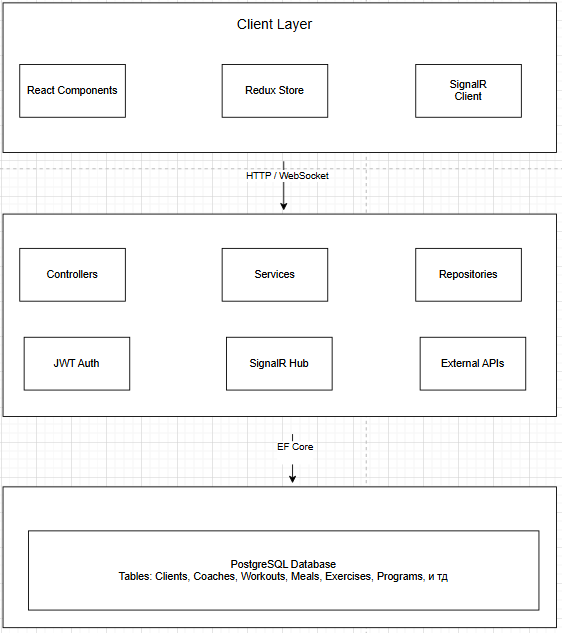

Рисунок 2.1 - Архитектурная схема приложения web_health

Представленная архитектура показывает, что пользователь не обращается напрямую к базе данных или внешним сервисам. Все операции проходят через backend, что позволяет централизованно контролировать авторизацию, обработку ошибок и правила доступа к данным.

## 2.2 Проектирование базы данных

### 2.2.1 Описание основных сущностей

Модель данных приложения построена вокруг пользователя. Сущность Client хранит персональную информацию: фамилию, имя, отчество, дату рождения, электронную почту, хеш пароля, номер телефона, сведения о здоровье, рост, вес и роль пользователя. Эта сущность является центральной, так как большинство пользовательских данных связано именно с клиентом.

Сущность WorkoutSession описывает тренировочную сессию. Она содержит идентификатор пользователя, дату, длительность, заметки, статус и коллекцию упражнений. Статус тренировки позволяет различать запланированные и выполненные занятия. Это важно для будущего расширения системы, например для построения календаря, статистики выполнения плана и уведомлений.

Сущность WorkoutSessionExercise связывает тренировочную сессию с упражнением. Она содержит идентификатор тренировки, идентификатор упражнения, порядок выполнения, заметки и JSON-структуру подходов. В этой же сущности хранятся агрегированные показатели: количество выполненных подходов, суммарное число повторений и тоннаж. Такое решение уменьшает количество вычислений при отображении списка тренировок.

Сущность Exercise является локальным справочником упражнений. Она содержит идентификатор упражнения во внешней системе Wger, название, описание, категорию, мышечную группу и ссылку на изображение. Использование локального справочника позволяет не зависеть полностью от доступности внешнего API при работе с уже сохраненными тренировками.

Сущность MealEntry описывает запись пищевого дневника. Она содержит дату, время, тип приема пищи, название продукта, бренд, количество, единицу измерения, калории, белки, углеводы и жиры. Дополнительно может храниться идентификатор продукта во внешней системе FatSecret. Это позволяет связать пользовательскую запись с источником справочной информации.

Сущность PersonalFood хранит личные продукты пользователя. Она нужна для случаев, когда продукт отсутствует во внешней базе или когда пользователь регулярно употребляет собственное блюдо. В сущности сохраняются название, бренд, пищевая ценность на порцию, размер порции, единица измерения и дата использования.

### 2.2.2 Связи между сущностями

Один пользователь может иметь множество тренировочных сессий, записей питания и личных продуктов. Такая связь отражает индивидуальный характер данных: каждый пользователь работает только со своей историей тренировок и питания. При проектировании API это означает, что почти все операции должны учитывать идентификатор пользователя из токена.

Одна тренировочная сессия может содержать множество упражнений. При этом одно и то же упражнение из справочника может использоваться в разных тренировках и разными пользователями. Поэтому связь между тренировкой и упражнением вынесена в отдельную сущность WorkoutSessionExercise.

Записи питания связаны с пользователем напрямую. Это упрощает выборки по дате и расчет дневной сводки. Для ускорения таких операций в AppDbContext предусмотрены индексы по ClientId и EntryDate. Благодаря этому сервер может быстро получать записи конкретного пользователя за выбранный день.

Личные продукты также связаны с пользователем напрямую. Это необходимо, потому что один пользователь может сохранить продукт с определенной пищевой ценностью, а другой пользователь может создать продукт с таким же названием, но другой рецептурой или размером порции. Разделение по пользователям предотвращает конфликт данных.

### 2.2.3 Обоснование использования jsonb для подходов

Для хранения подходов упражнения выбран формат JSONB в PostgreSQL. Подходы имеют переменную структуру: в одной тренировке пользователь может выполнить три подхода, в другой - пять или больше. Создание отдельной таблицы подходов позволило бы более строго нормализовать модель, но увеличило бы количество сущностей, запросов и операций обновления.

Использование JSONB позволяет хранить список подходов внутри записи WorkoutSessionExercise. Такой вариант удобен для клиентского приложения, потому что frontend также работает с подходами как с массивом объектов. При сохранении тренировки массив подходов сериализуется и передается на сервер, где сохраняется в базе данных.

Недостатком такого подхода является меньшая гибкость при сложных аналитических SQL-запросах по отдельным подходам. Поэтому в модели дополнительно предусмотрены агрегированные поля CompletedSets, TotalReps и TotalTonnage. Они позволяют быстро получать основные показатели нагрузки без разбора JSON-структуры при каждом чтении.

Для текущей версии проекта выбранный подход является оправданным, так как главная задача модуля тренировок состоит в сохранении и отображении пользовательских тренировок. При дальнейшем развитии аналитики можно рассмотреть выделение подходов в отдельную таблицу или создание дополнительных материализованных представлений.

Центральным элементом хранения данных является AppDbContext. В нем определены наборы сущностей: Clients, Coaches, Exercises, Diets, TrainingPrograms, TrainingProgramExercises, MealEntries, PersonalFoods, WorkoutSessions и WorkoutSessionExercises.

Сущность Client хранит данные пользователя: фамилию, имя, отчество, дату рождения, электронную почту, пароль, телефон, сведения о здоровье, рост, вес и роль. Сущность WorkoutSession описывает тренировку пользователя, а WorkoutSessionExercise связывает тренировку с конкретным упражнением. Для хранения подходов используется поле SetsJson с типом jsonb.

Сущность MealEntry описывает запись пищевого дневника и содержит дату, время, тип приема пищи, название продукта, количество, единицу измерения и пищевую ценность. PersonalFood используется для хранения личных продуктов пользователя.

Для хранения наборов подходов в тренировочной сессии используется JSON-структура. Такой подход позволяет сохранять переменное количество подходов без создания отдельной таблицы для каждого подхода. Одновременно в таблице сохраняются агрегированные показатели: количество выполненных подходов, общее количество повторений и тоннаж. Эти поля нужны для быстрого отображения сводной информации и будущей аналитики.

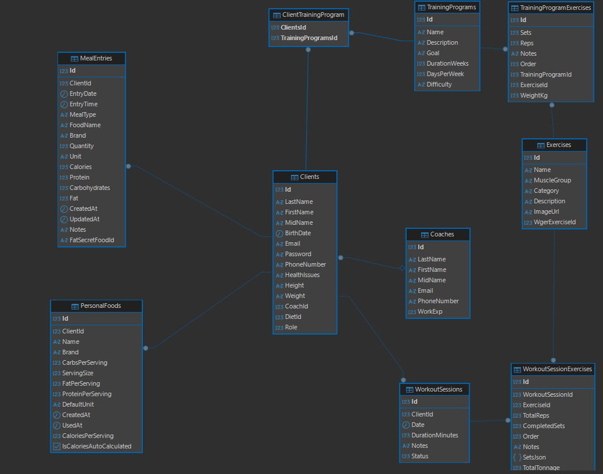

Рисунок 2.2 - Схема отношений между таблицами базы данных

Схема базы данных подтверждает, что основная часть пользовательской информации связана с сущностью клиента. Такая организация позволяет изолировать данные разных пользователей и упростить выборки для тренировок, питания и личных продуктов.

## 2.3 Реализация серверной части

### 2.3.1 Контроллеры серверной части

Серверная часть приложения организована вокруг набора контроллеров ASP.NET Core. Каждый контроллер отвечает за отдельную область функциональности. Такое разделение делает API более понятным и позволяет развивать отдельные модули независимо.

AuthController реализует регистрацию и вход пользователя. Он принимает учетные данные, передает их в AuthService и возвращает результат клиенту. При успешной авторизации пользователь получает JWT-токен, который затем используется для доступа к защищенным методам.

ClientController отвечает за работу с профилем пользователя. Наиболее важным методом является получение профиля текущего пользователя по токену. Этот метод используется клиентским приложением после входа и при восстановлении состояния авторизации после обновления страницы.

WorkoutSessionController реализует операции с тренировочными сессиями. Он позволяет создавать тренировку, получать список тренировок пользователя, получать тренировку по идентификатору, обновлять тренировку, удалять ее и изменять упражнения внутри тренировки. Для защищенности данных идентификатор клиента извлекается из claims токена.

MealEntriesController отвечает за пищевой дневник. В нем реализованы методы получения записей за дату, получения записей за период, расчета дневной сводки, добавления, обновления и удаления записи. Этот контроллер является основой модуля питания.

PersonalFoodsController отвечает за личные продукты пользователя. Он позволяет искать сохраненные продукты, добавлять новый личный продукт, получать продукт по идентификатору и удалять его. Такой функционал нужен для повторного использования часто употребляемых продуктов.

NutritionController и WgerController реализуют интеграции с внешними сервисами. NutritionController обращается к FatSecret для поиска продуктов и получения подробной пищевой ценности. WgerController обращается к Wger для получения упражнений, категорий, мышц, оборудования и изображений.

### 2.3.2 Сервисный слой и репозитории

Сервисный слой содержит бизнес-логику приложения. AuthService отвечает за проверку учетных данных, регистрацию пользователя и создание ответа авторизации. JwtService формирует токен и добавляет в него claims пользователя. WorkoutSessionService реализует операции с тренировками и пересчет агрегированных показателей. MealEntryService отвечает за пищевой дневник и расчет дневной сводки.

Репозитории инкапсулируют доступ к базе данных. Такой подход отделяет бизнес-логику от деталей работы Entity Framework Core. Если в дальнейшем потребуется изменить способ хранения данных или оптимизировать отдельные запросы, изменения можно будет локализовать на уровне репозитория.

Использование dependency injection позволяет передавать контроллерам необходимые сервисы через конструктор. Это снижает связанность компонентов и делает код удобнее для тестирования. В Program.cs регистрируются репозитории, сервисы, HttpClient, AutoMapper, MemoryCache и другие зависимости.

### 2.3.3 Авторизация и защита данных

Для авторизации используется JWT. После успешного входа сервер формирует токен, содержащий идентификатор пользователя, email, имя и роль. Клиент сохраняет токен и передает его в заголовке Authorization при обращении к защищенным методам. Сервер проверяет подпись токена, срок действия, издателя и аудиторию.

Пароли пользователей хранятся в виде хеша BCrypt. Это важно, потому что база данных может содержать чувствительную информацию. Даже если злоумышленник получит доступ к базе, он не должен увидеть исходные пароли пользователей. При входе введенный пароль сравнивается с сохраненным хешем.

Часть контроллеров помечена атрибутом Authorize. Это означает, что доступ к ним невозможен без действительного токена. Для операций с тренировками и питанием этого недостаточно само по себе: сервер также должен использовать идентификатор пользователя из токена, чтобы пользователь не мог получить чужие данные.

В текущей версии проекта токен хранится в localStorage. Это простое решение для учебного прототипа, но для промышленной эксплуатации его можно усилить. Более безопасным вариантом является хранение токена в httpOnly cookie, добавление refresh token и настройка более строгой политики CORS.

Серверный проект использует ASP.NET Core и .NET 9. В файле Program.cs выполняется настройка Kestrel, контроллеров, JWT-аутентификации, Swagger, Entity Framework Core, CORS, AutoMapper, MemoryCache, HttpClient, сервисов, репозиториев и SignalR. При запуске приложения выполняется применение миграций базы данных через Database.Migrate().

Логика серверной части разделена на контроллеры, сервисы и репозитории. Контроллеры принимают HTTP-запросы и формируют ответы. Сервисы содержат бизнес-логику, а репозитории инкапсулируют доступ к данным.

Перед началом разработки было подготовлено рабочее окружение со следующими компонентами:

Серверная часть:

.NET 8.0 SDK [5];

PostgreSQL 15 [6];

Visual Studio 2022 / VS Code;

pgAdmin для управления базой данных.

Клиентская часть:

Node.js 20 LTS;

npm 10;

Vite 5 [3];

Расширения для TypeScript и React [2].

Инструменты контроля версий:

Git для управления исходным кодом;

GitHub для хостинга репозитория [15].

Конфигурация проекта включает файлы:

appsettings.json – настройки подключения к БД и внешним API;

vite.config.ts – параметры сборки фронтенда;

.env – переменные окружения (секретные ключи, строки подключения).

Все компоненты окружения были успешно установлены и настроены, что позволило приступить к непосредственной реализации ключевой функциональности – начиная с системы аутентификации и авторизации пользователей.

Модуль аутентификации включает следующие компоненты:

Контроллер AuthController – обрабатывает HTTP-запросы на регистрацию и вход. Для выполнения запросов на клиенте используется библиотека Axios [13].

Сервис AuthService – содержит бизнес-логику проверки учётных данных и генерации токенов.

Репозиторий UserRepository – абстрагирует доступ к таблице пользователей.

Алгоритм регистрации нового пользователя:

получение данных из формы (email, пароль, имя, роль);

валидация формата email и сложности пароля;

проверка уникальности email в базе данных;

хеширование пароля алгоритмом BCrypt;

сохранение записи в таблице Clients;

возврат успешного ответа клиенту.

Алгоритм аутентификации:

поиск пользователя по email;

проверка хеша пароля;

формирование claims с информацией о пользователе;

генерация JWT-токена с подписью;

возврат токена и данных профиля клиенту.

Для входа в систему пользователь должен ввести зарегистрированные email и пароль. На рисунке 3 представлен интерфейс авторизации, где расположены поля ввода и кнопка «Войти». Также предусмотрена ссылка на страницу регистрации для новых пользователей. При успешной аутентификации сервер выдаёт JWT-токен, который сохраняется в локальном хранилище браузера и используется для авторизации во всех последующих запросах.

После успешного входа система возвращает JSON Web Token, содержащий идентификатор пользователя, его роль (клиент/тренер) и время истечения срока действия. На рисунке 4 приведён пример сохранённого токена в формате JWT, который можно увидеть в инструментах разработчика (вкладка Application → Local Storage). Токен подписан секретным ключом на сервере, что гарантирует его подлинность и защиту от подделки.

Таким образом, реализованная система управления доступом обеспечивает безопасную регистрацию и аутентификацию пользователей с использованием JWT-токенов. Хранение паролей в хешированном виде (BCrypt) и передача токенов через HTTPS гарантируют защиту учётных данных от перехвата и компрометации. Модуль аутентификации полностью готов к интеграции с остальными компонентами приложения – тренировками и пищевым дневником.

| Метод | Маршрут | Назначение | Авторизация |
| --- | --- | --- | --- |
| POST | api/Auth/Login/login | Вход пользователя и получение JWT | Нет |
| POST | api/Auth/Register/register | Регистрация пользователя | Нет |
| GET | api/Client/GetMyProfile/me | Получение профиля текущего пользователя | Да |
| GET | api/WorkoutSession/GetAllByClient | Получение тренировок пользователя | Да |
| POST | api/WorkoutSession/Create | Создание тренировочной сессии | Да |
| GET | api/MealEntries/summary | Получение дневной сводки КБЖУ | Да |
| GET | api/Nutrition/SearchFoods/search | Поиск продуктов через FatSecret | Нет |
| GET | api/Wger/exercises | Поиск упражнений через Wger | Нет |

Таблица 2.1 - Основные программные интерфейсы системы

Перечисленные методы образуют минимальный набор API, необходимый для работы приложения. Они покрывают авторизацию, профиль пользователя, тренировки, пищевой дневник и внешние справочники, то есть все ключевые функциональные требования.

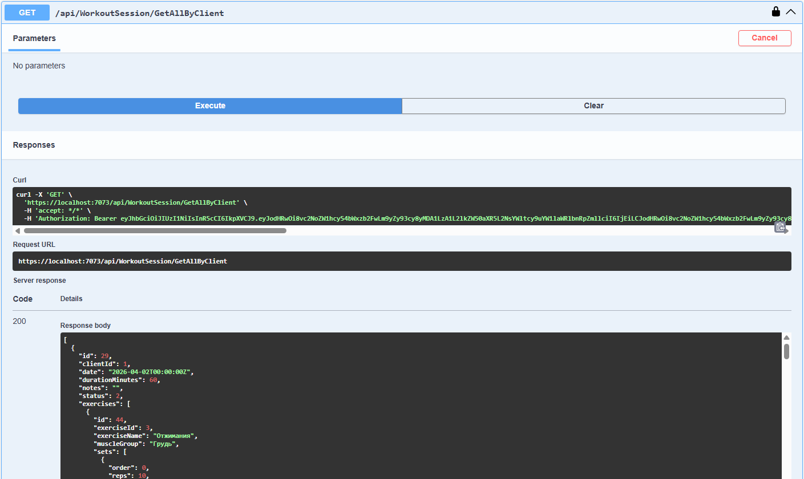

Рисунок 2.3 - Проверка серверных методов и Swagger-интерфейса

Проверка через Swagger и инструменты разработки позволяет убедиться, что backend корректно принимает запросы и возвращает структурированные ответы. Это особенно важно для согласования серверной и клиентской частей приложения.

## 2.4 Реализация клиентской части

Клиентский проект реализован как одностраничное приложение. Точкой входа является main.tsx, где React-приложение оборачивается в StrictMode, Provider Redux и BrowserRouter. Далее подключается общий HeaderComponent и описываются маршруты.

Страница авторизации включает формы входа и регистрации. При входе LoginComponent отправляет email и пароль на сервер, получает токен, затем запрашивает профиль текущего пользователя и сохраняет результат в Redux. При регистрации RegisterComponent отправляет данные нового пользователя на сервер и сохраняет полученный токен.

Состояние авторизации хранится в Redux Toolkit. В хранилище сохраняются токен, профиль пользователя, состояние загрузки и возможная ошибка. После успешного входа токен записывается в localStorage, а профиль сохраняется в глобальном состоянии приложения. При выходе токен удаляется, а защищенные страницы становятся недоступными.

Для сетевого взаимодействия используются axios и fetch. Часть запросов вынесена в специализированные сервисы: workoutApi отвечает за тренировки, nutritionApi - за поиск продуктов и личные продукты, foodLogApi - за операции пищевого дневника. Такой подход отделяет работу с API от визуальных компонентов.

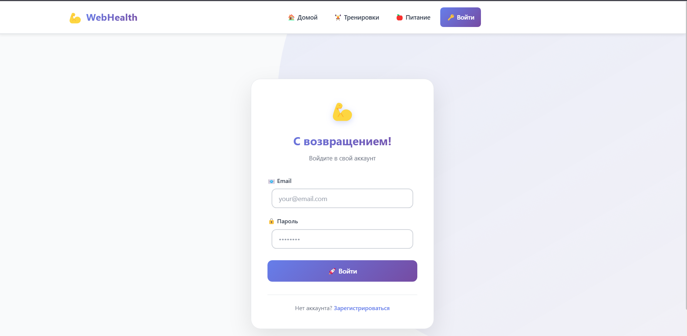

Рисунок 2.4 - Интерфейс авторизации пользователя

Форма авторизации является входной точкой в защищенную часть приложения. После успешного входа пользователь получает токен, который используется для обращения к API профиля, тренировок и питания.

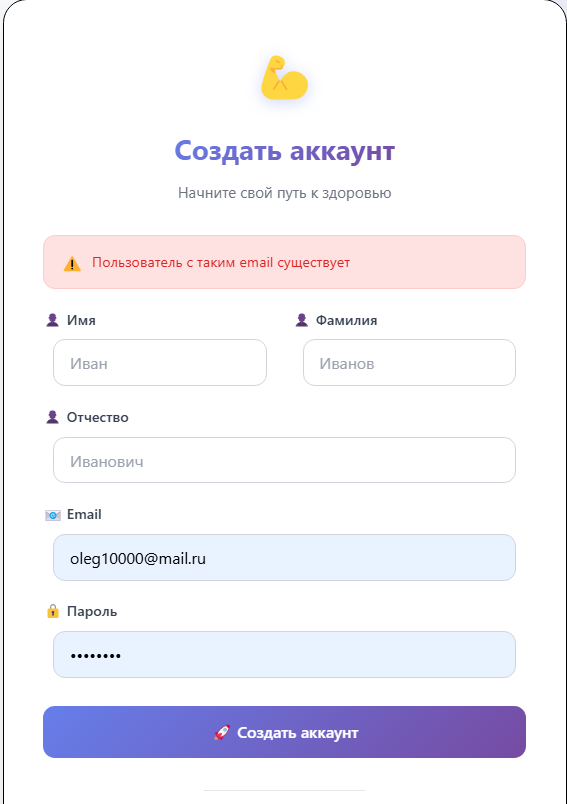

Рисунок 2.5 - Интерфейс регистрации пользователя

Форма регистрации собирает минимальный набор данных, необходимый для создания учетной записи. Такой подход уменьшает порог входа для пользователя и позволяет после регистрации сразу перейти к работе с приложением.

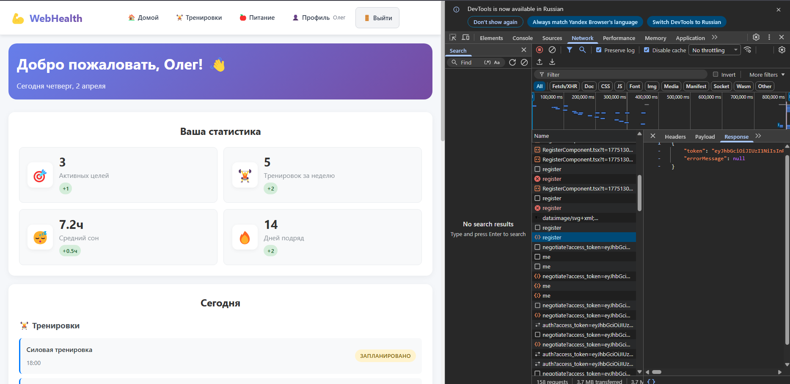

Рисунок 2.6 - Главная страница и отладка клиентского приложения

Отладка клиентского приложения подтверждает, что интерфейс взаимодействует с серверной частью и получает данные для отображения. Это связывает визуальный слой приложения с реализованными API-методами.

## 2.5 Реализация модулей тренировок и питания

Модуль тренировок позволяет пользователю просматривать календарь тренировок, создавать новую тренировочную сессию, выбирать упражнения, указывать подходы, повторения и вес, а также редактировать существующую тренировку. На сервере каждая тренировка привязана к текущему пользователю, поэтому пользователь видит только собственные данные.

Модуль тренировок предоставляет возможности:

просмотра библиотеки упражнений;

создания персональных программ;

фиксации выполненных сессий;

анализа прогресса по времени.

Контроллеры:

ExerciseController – работа с упражнениями;

TrainingProgramController – управление программами;

WorkoutSessionController – учёт тренировок.

Клиентские компоненты:

ExerciseList – отображение доступных упражнений;

ProgramBuilder – конструктор программ;

WorkoutLogger – форма записи результатов;

ProgressChart – визуализация динамики.

Процесс создания тренировки:

пользователь выбирает упражнения из каталога;

для каждого упражнения указывает параметры (подходы, повторения, вес);

сохраняет программу с названием и описанием;

при выполнении отмечает завершённые подходы;

данные сохраняются в базе для последующего анализа.

Основной экран модуля тренировок содержит список доступных упражнений, каталог созданных программ и кнопку для быстрого старта тренировки. На рисунке 5 показан интерфейс управления тренировками, где пользователь может выбрать нужную программу, посмотреть её детали (упражнения, подходы, повторения) и начать выполнение. Также доступна функция редактирования существующих программ и удаления устаревших.

Для отслеживания прогресса система строит графики изменения рабочих весов, количества повторений и объёма нагрузки по дням. На рисунке 6 представлена визуализация результатов тренировок за последние две недели: на линейном графике отображена динамика прогресса в упражнении «Жим лёжа». Пользователь может выбрать любое упражнение и период для детального анализа своих достижений.

Каждая созданная программа тренировок содержит подробную информацию: название, уровень сложности, предполагаемую длительность выполнения, а также список упражнений с целевыми значениями подходов, повторений и весов. Пользователь может в любой момент отредактировать программу, удалить устаревшие упражнения или добавить новые. После сохранения программа становится доступной для выполнения в разделе «Мои тренировки». Все данные о программах и выполненных сессиях сохраняются в базе данных и связываются с конкретным пользователем, что позволяет вести историю тренировок за любой период.

Разработанный модуль тренировок позволяет пользователям создавать персонализированные программы, фиксировать результаты выполненных подходов и отслеживать прогресс через визуализацию данных (линейные графики изменения весов и объёма нагрузки). Интеграция с Wger API обеспечивает доступ к обширной библиотеке упражнений с описанием техники выполнения и указанием целевых мышечных групп. Все данные сохраняются в базе данных и могут быть использованы для последующего анализа динамики спортивных показателей.

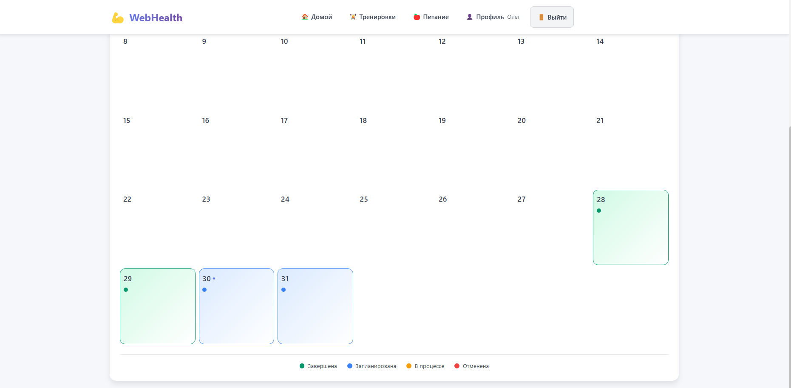

Рисунок 2.7 - Календарь тренировок пользователя

Календарь тренировок выбран как основной способ навигации по тренировочным сессиям. Он позволяет пользователю воспринимать тренировки не как разрозненный список, а как план и историю занятий по датам.

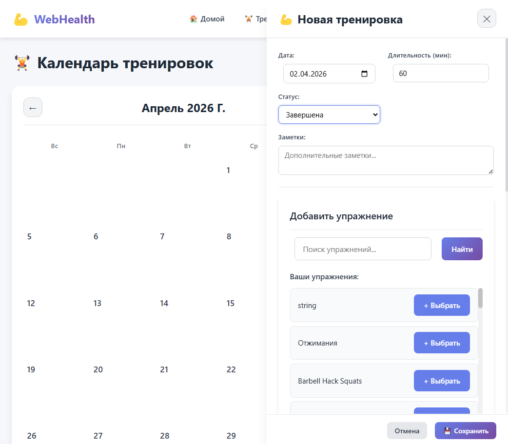

Рисунок 2.8 - Создание новой тренировки

Форма создания тренировки фиксирует базовые параметры занятия: дату, длительность, статус и заметки. Эти данные используются для отображения тренировки в календаре и для дальнейшего анализа активности пользователя.

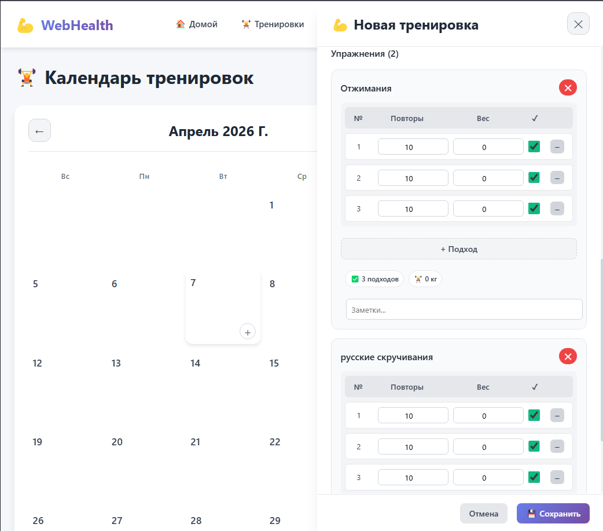

Рисунок 2.9 - Заполнение упражнений и подходов в тренировке

Заполнение упражнений и подходов показывает детализацию тренировочного процесса. Пользователь может учитывать не только факт занятия, но и конкретную нагрузку по каждому упражнению.

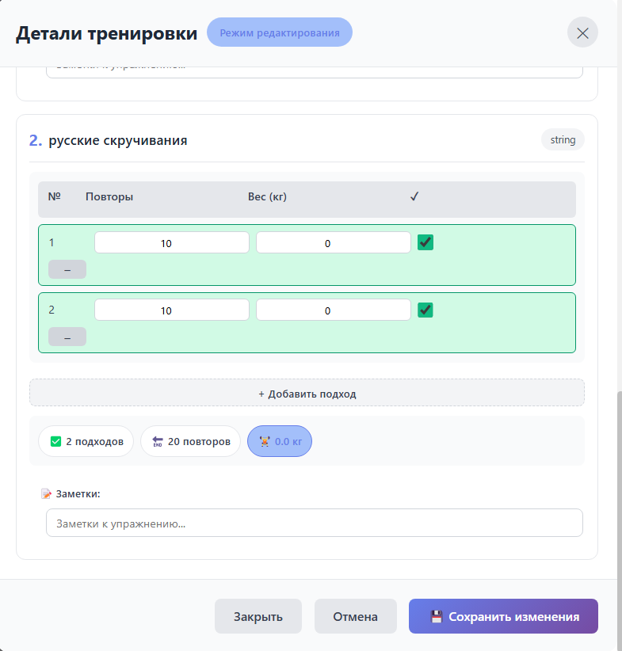

Рисунок 2.10 - Сохранение выполненных подходов

После сохранения подходов данные передаются на сервер и используются для пересчета агрегированных показателей. Это позволяет в дальнейшем строить аналитику по объему нагрузки и прогрессу пользователя.

Модуль питания позволяет пользователю вести дневник приемов пищи. Основной сценарий включает выбор даты, поиск продукта, выбор порции, ввод количества и сохранение записи. После добавления записи пользователь видит обновленный список и дневную сводку по калориям и макронутриентам.

Функционал учёта питания включает:

поиск продуктов в базе FatSecret;

добавление записей о приёмах пищи;

расчёт суточной нормы калорий;

отображение распределения макронутриентов.

Контроллеры:

MealEntriesController – операции с записями о питании;

NutritionController – данные о пищевой ценности;

PersonalFoodsController – пользовательские продукты.

Клиентские компоненты:

FoodSearch – поиск по базе продуктов;

MealLogger – форма добавления записи;

DailySummary – сводка за день;

MacroChart – диаграмма БЖУ.

Алгоритм добавления приёма пищи:

пользователь вводит название продукта в поле поиска;

система отправляет запрос к FatSecret API;

отображаются результаты поиска;

пользователь выбирает продукт и указывает количество;

система рассчитывает калории и макронутриенты;

запись сохраняется в базе данных;

обновляется дневная статистика.

Главная страница пищевого дневника отображает записи о приёмах пищи за текущий день, суммарную калорийность и распределение белков, жиров, углеводов. На рисунке 7 приведён интерфейс учёта питания, где пользователь может добавлять новые приёмы пищи, просматривать историю и редактировать существующие записи. В верхней части расположена строка поиска продуктов, интегрированная с FatSecret API.

При добавлении нового приёма пищи пользователь выбирает продукт из результатов поиска, указывает массу порции в граммах и тип приёма (завтрак, обед, ужин, перекус). На рисунке 8 представлена форма добавления записи: выбран продукт «Куриная грудка варёная», указано количество 200 г. Система автоматически рассчитывает калорийность (330 ккал) и макронутриенты (белки 62 г, жиры 7 г, углеводы 0 г).

После добавления записей система обновляет круговую диаграмму, наглядно показывающую долю белков, жиров и углеводов в общем рационе за день. На рисунке 9 приведена диаграмма распределения БЖУ для примера: белки составляют 35%, жиры – 25%, углеводы – 40%. Пользователь может видеть не только проценты, но и абсолютные значения в граммах, что помогает корректировать питание для достижения целей (похудение, набор массы и т.д.).

Разработанный модуль питания в полной мере реализует функциональность пищевого дневника: пользователь может искать продукты во внешней базе FatSecret, добавлять приёмы пищи с автоматическим расчётом калорий и макронутриентов, а также просматривать суточную сводку и распределение БЖУ в виде круговой диаграммы.

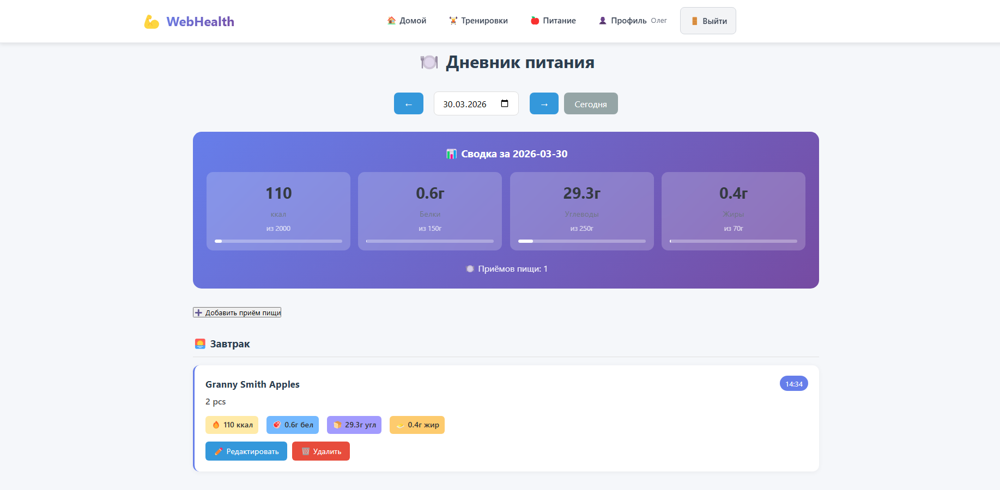

Рисунок 2.11 - Страница дневника питания

Страница дневника питания объединяет список приемов пищи и дневную сводку. Пользователь видит не только отдельные записи, но и общий результат за выбранную дату.

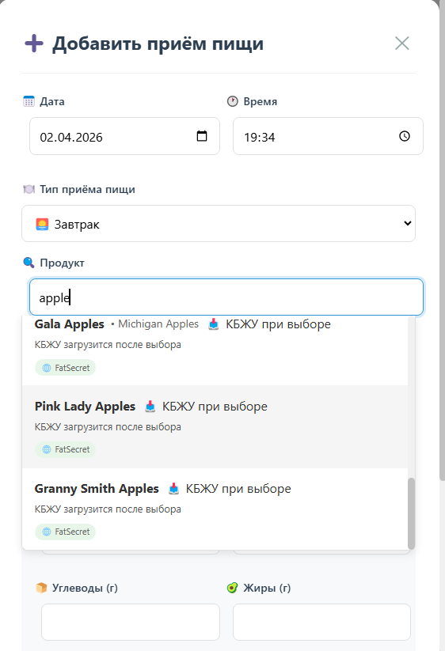

Рисунок 2.12 - Форма добавления приема пищи

Форма добавления приема пищи предназначена для ввода продукта, количества и типа приема пищи. Она является основным интерфейсом пополнения пищевого дневника.

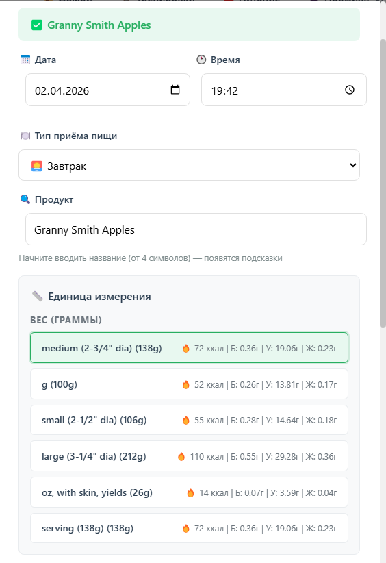

Рисунок 2.13 - Поиск продукта при добавлении приема пищи

Поиск продукта снижает объем ручного ввода и уменьшает вероятность ошибок при заполнении пищевой ценности. Пользователь может выбрать продукт из внешнего или личного справочника.

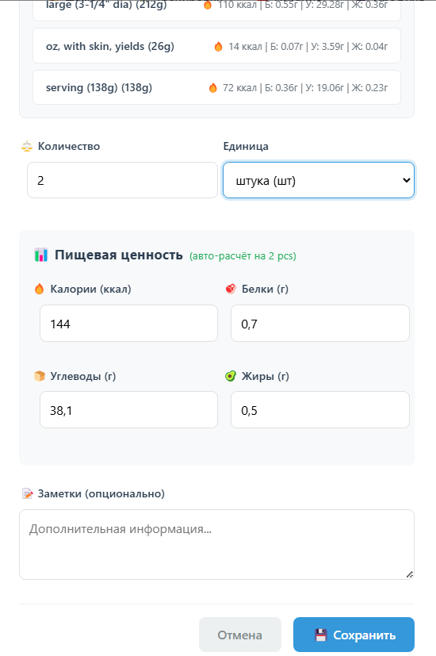

Рисунок 2.14 - Расчет пищевой ценности записи

Расчет пищевой ценности показывает, как количество продукта преобразуется в калории и макронутриенты. Это делает дневник питания полезным не только как список продуктов, но и как инструмент контроля рациона.

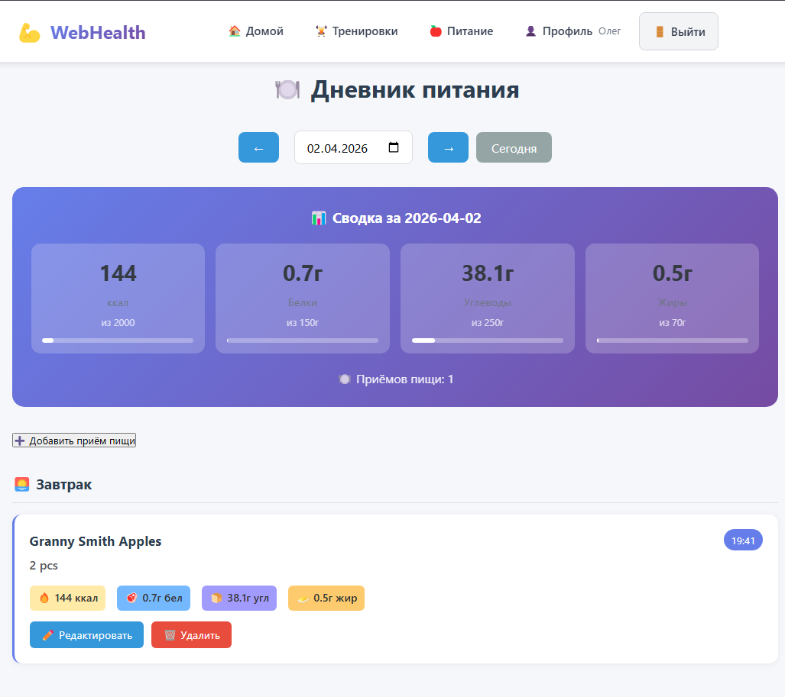

Рисунок 2.15 - Обновленная сводка дневника питания

Обновленная сводка подтверждает, что добавленные записи влияют на итоговые показатели дня. Таким образом проверяется связь между формой ввода, серверной логикой и отображением результата.

## 2.6 Тестирование разработанного приложения

### 2.6.1 Методика проверки

Проверка приложения выполнялась по пользовательским сценариям, так как именно сценарии показывают, достигается ли цель разработки. Для каждого сценария определялись начальные условия, действия пользователя, ожидаемый результат и фактический результат. Такой подход позволяет проверить не только отдельные методы API, но и взаимодействие frontend, backend и базы данных.

Первым проверялся сценарий регистрации. Пользователь вводит имя, фамилию, email и пароль. Клиент отправляет данные на сервер, сервер проверяет уникальность email, создает пользователя, хеширует пароль и возвращает токен. Успешность сценария подтверждается сохранением токена и переходом пользователя в авторизованную часть приложения.

Вторым проверялся сценарий входа. Пользователь вводит email и пароль, после чего сервер проверяет учетные данные. При корректном пароле возвращается токен, затем клиент запрашивает профиль текущего пользователя. При неверном пароле пользователь должен получить ошибку, а защищенные страницы не должны открываться.

Третьим проверялся сценарий создания тренировки. Пользователь открывает календарь тренировок, выбирает дату, создает тренировку, добавляет упражнения и заполняет подходы. После сохранения тренировка должна появиться в списке и быть доступной для повторного открытия.

Четвертым проверялся сценарий пищевого дневника. Пользователь выбирает дату, добавляет продукт, указывает количество и сохраняет запись. После сохранения запись должна появиться в списке, а дневная сводка должна измениться с учетом добавленной пищевой ценности.

Пятым проверялся сценарий интеграции. При поиске продукта или упражнения приложение должно отправлять запрос на сервер, сервер должен обратиться к внешнему API и вернуть данные клиенту. В случае отсутствия результата интерфейс не должен ломаться, а пользователь должен иметь возможность продолжить работу.

### 2.6.2 Таблица тестовых сценариев

| Номер | Проверяемый сценарий | Шаги проверки | Ожидаемый результат |
| --- | --- | --- | --- |
| 1 | Регистрация пользователя | Заполнить форму регистрации и отправить данные | Пользователь создан, токен сохранен |
| 2 | Вход пользователя | Ввести email и пароль существующего пользователя | Загружен профиль, открыт доступ к защищенным страницам |
| 3 | Неверный пароль | Ввести неправильный пароль | Отображается ошибка, доступ не предоставляется |
| 4 | Защищенный маршрут | Открыть профиль без токена | Выполняется переход на страницу входа |
| 5 | Создание тренировки | Добавить дату, упражнение и подходы | Тренировка сохранена в базе данных |
| 6 | Обновление подходов | Изменить повторения и вес | Агрегированные показатели пересчитаны |
| 7 | Добавление приема пищи | Добавить продукт в дневник | Запись отображается в списке за дату |
| 8 | Расчет дневной сводки | Получить сводку после добавления записи | Калории и макронутриенты увеличены |
| 9 | Поиск продукта | Выполнить поиск через FatSecret | Пользователь видит найденные продукты |
| 10 | Поиск упражнения | Выполнить поиск через Wger | Пользователь видит найденные упражнения |


Тестовые сценарии покрывают основные действия пользователя и ключевые точки взаимодействия frontend, backend и базы данных. Такой набор проверок достаточен для подтверждения работоспособности прототипа, но при дальнейшем развитии проекта его следует расширять автоматизированными тестами.

### 2.6.3 Ограничения текущей реализации

Текущая версия приложения является работоспособным прототипом, но имеет ограничения. Часть маршрутов API использует шаблон с action в адресе, а часть построена ближе к REST-подходу. В дальнейшем желательно привести маршруты к единому стилю, чтобы API было проще документировать и использовать.

В клиентской части часть запросов выполняется через общий apiClient, а часть - через отдельные вызовы axios или fetch. Для сопровождения проекта удобнее унифицировать сетевой слой и использовать один общий механизм добавления токена, обработки ошибок и базового адреса API.

Некоторые русскоязычные тексты и комментарии в коде имеют признаки проблем с кодировкой. Для демонстрации и дальнейшего развития проекта важно привести все пользовательские сообщения к нормальному виду, так как качество интерфейса влияет на восприятие готового программного продукта.

Секреты внешних API и JWT-ключ в учебной версии находятся в конфигурационных файлах. Для реального развертывания такой подход небезопасен. Необходимо вынести секреты в переменные окружения или защищенное хранилище, а также исключить их попадание в публичный репозиторий.

В проекте пока недостаточно автоматических тестов. Для повышения надежности следует добавить модульные тесты сервисов, интеграционные тесты API и тесты ключевых компонентов frontend. Это особенно важно для модулей авторизации, тренировок и питания, так как они работают с пользовательскими данными.

Проверка работоспособности приложения выполнялась по основным пользовательским сценариям. Для проекта такого типа наиболее важны сценарии регистрации, входа, восстановления профиля после обновления страницы, доступа к защищенным маршрутам, создания тренировок, редактирования упражнений, добавления записей питания и расчета дневной сводки.

2.2.1 Подходы к тестированию веб-приложений

Тестирование разрабатываемого веб-приложения проводилось на трёх уровнях: модульное, интеграционное и системное. Такая иерархия позволяет выявлять дефекты на ранних стадиях и гарантировать корректную работу системы в целом.

Модульное тестирование направлено на проверку отдельных функций и методов в изоляции от внешних зависимостей (базы данных, файловой системы, сетевых вызовов). Для backend-части, реализованной на ASP.NET Core, использовался фреймворк xUnit. С помощью библиотеки Moq создавались заглушки (mock-объекты) для репозиториев и сервисов, что позволяло тестировать бизнес-логику без реального подключения к базе данных. Модульными тестами были покрыты следующие компоненты: валидация входных данных (email, пароль), хеширование паролей алгоритмом BCrypt, генерация и проверка JWT-токенов, расчёт калорий и макронутриентов при добавлении приёма пищи, а также фильтрация и сортировка списка тренировок. Для frontend-части на React применялся фреймворк Jest. С его помощью тестировались React-компоненты (например, формы регистрации и авторизации) в изолированной среде без реального DOM, а также Redux-редьюсеры и асинхронные действия (thunks). Модульные тесты запускались автоматически при каждой сборке проекта в CI-пайплайне GitHub Actions, что позволяло оперативно обнаруживать регрессии.

Интеграционное тестирование проверяло взаимодействие между компонентами системы: контроллерами, сервисами, репозиториями и базой данных. В отличие от модульных тестов, здесь использовалась реальная тестовая база данных PostgreSQL, развёрнутая в контейнере Docker. Интеграционные тесты охватывали следующие сценарии: регистрация нового пользователя с последующим поиском в БД, аутентификация с проверкой хеша пароля, создание программы тренировок и сохранение её в таблицы TrainingPrograms и ProgramExercises, добавление записи о питании с автоматическим пересчётом дневной статистики, выполнение запросов к внешним API FatSecret и Wger с использованием тестовых ключей (при этом ответы кэшировались, чтобы не превышать лимиты бесплатных тарифов). Также интеграционные тесты проверяли корректность работы внешних ключей и каскадного удаления (например, при удалении пользователя все его тренировочные сессии и записи о питании должны удаляться автоматически). Все интеграционные тесты запускались в изолированной тестовой среде, которая после каждого теста очищалась (сброс состояния БД).

Системное тестирование (сквозное) проводилось для проверки полных пользовательских сценариев через веб-интерфейс. Выполнялось как в ручном режиме, так и с помощью автоматизированных end-to-end тестов на базе Playwright. Ручное тестирование включало проверку удобства интерфейса (юзабилити): логичность расположения элементов, понятность сообщений об ошибках, адаптивность вёрстки при изменении размера окна браузера. Автоматизированные end-to-end тесты имитировали действия реального пользователя: открытие страницы регистрации, заполнение формы, нажатие кнопки, проверку появления сообщения об успехе, затем вход в систему, создание программы тренировок, добавление приёма пищи и выход. Такие тесты прогонялись в трёх браузерах (Chrome, Firefox, Edge) для проверки кросс-браузерной совместимости.

Критерии успешного тестирования были определены следующим образом:

все критические сценарии (регистрация, вход, создание программы, добавление приёма пищи, просмотр истории) выполняются без ошибок;

время отклика API для типовых запросов (GET /api/workouts, POST /api/meals) не превышает 500 мс (измерялось с помощью встроенного middleware логирования);

отсутствуют утечки памяти при длительной работе (приложение работало под нагрузкой в течение 8 часов с периодическим добавлением записей, потребление памяти стабилизировалось на уровне 250–300 МБ);

корректная обработка граничных значений: ввод пустых полей, слишком длинных строк (более 255 символов), отрицательных весов, неверных форматов email, попытка удаления несуществующей записи.

Инструменты тестирования:

xUnit – для модульных и интеграционных тестов backend;

Moq – для создания mock-объектов;

Jest + React Testing Library – для тестирования React-компонентов и Redux;

Playwright – для end-to-end тестирования;

Postman – для ручного тестирования API при отладке;

pgTAP – для проверки хранимых процедур и триггеров в PostgreSQL (использовался выборочно).

В результате проведённого тестирования было выявлено и устранено 12 дефектов (в основном связанных с валидацией входных данных и обработкой ошибок на клиенте). Процент покрытия кода тестами составил 78% для backend и 65% для frontend, что превышает минимально рекомендуемый порог для учебных проектов. Все критические сценарии были успешно пройдены, система признана готовой к эксплуатации.

2.2.2 Результаты проверки модуля регистрации и входа

Были протестированы следующие сценарии:

Сценарий 1: Успешная регистрация

Входные данные: корректный email, пароль от 8 символов;

Ожидаемый результат: пользователь создан, токен получен;

Фактический результат: тест пройден (рисунок 10, рисунок 11).

Для проверки сценария успешной регистрации пользователь вводит в форму корректные данные: email в формате «user@example.com», пароль длиной не менее 8 символов (например, «Password123»), имя и выбирает роль «Клиент». На рисунке 10 приведён пример заполненной формы регистрации.

После нажатия кнопки «Зарегистрироваться» система выполняет валидацию данных, проверяет уникальность email и создаёт нового пользователя. На рисунке 11 показано успешное выполнение регистрации – сервер возвращает статус 201 Created и данные профиля (id, email, имя).

Сценарий 2: Регистрация с существующим email

Входные данные: email, уже присутствующий в базе;

Ожидаемый результат: ошибка «Пользователь уже существует»;

Фактический результат: тест пройден (рисунок 12).

При попытке зарегистрироваться с email, который уже есть в базе данных, система должна отклонить запрос и выдать сообщение об ошибке. На рисунке 12 показано, как при вводе существующего email (например, «existing@test.com») сервер возвращает статус 409 Conflict с текстом «Пользователь с таким email существует».

Сценарий 3: Вход с неверным паролем

Входные данные: правильный email, неправильный пароль;

Ожидаемый результат: ошибка «Неверные учётные данные»;

Фактический результат: тест пройден (рисунок 13).

Для проверки аутентификации с неверными учётными данными пользователь вводит правильный email, но неправильный пароль. Как показано на рисунке 13, сервер отвечает статусом 401 Unauthorized и сообщением «Неверная почта или пароль». При этом токен не выдаётся, а доступ к защищённым ресурсам блокируется.

Таким образом, модуль аутентификации корректно обрабатывает как успешные, так и ошибочные сценарии. Пользователь не может зарегистрироваться с уже существующим email или войти с неверным паролем, что соответствует требованиям безопасности.

2.2.3 Результаты проверки модуля тренировок

Сценарий 1: Создание программы

Действия: выбор упражнений, указание параметров, сохранение;

Ожидаемый результат: программа сохранена в базе;

Фактический результат: тест пройден (рисунок 14, рисунок 15).

В рамках тестирования модуля тренировок проверялась возможность создания персональной программы. Пользователь выбирает упражнения из каталога (например, «Жим лёжа», «Приседания со штангой»), задаёт количество подходов, повторений и рабочий вес. На рисунке 14 показан интерфейс конструктора программ на этапе выбора упражнений.

После выбора упражнений пользователь может настроить параметры для каждого из них: указать целевое количество повторений, вес снаряда и время отдыха. На рисунке 15 отображён процесс добавления упражнения «Становая тяга» в программу с заданными параметрами (3 подхода по 8 повторений с весом 80 кг).

Сценарий 2: Запись выполненной тренировки

Действия: отметка подходов, завершение;

Ожидаемый результат: сессия сохранена;

Фактический результат: тест пройден (рисунок 16, рисунок 17).

Для проверки фиксации результатов пользователь запускает ранее созданную программу и в процессе выполнения отмечает выполненные подходы. На рисунке 16 показана форма записи тренировки, где можно ввести фактическое количество повторений и вес для каждого подхода, а также добавить заметки о самочувствии.

После завершения тренировки система сохраняет все введённые данные и отображает детали сессии. Как показано на рисунке 17, пользователь может просмотреть дату, длительность тренировки, список выполненных упражнений с реальными показателями и сравнить их с плановыми.

Сценарий 3: Получение истории тренировок

Действия: запрос к endpoint истории;

Ожидаемый результат: возврат списка сессий за период;

Фактический результат: тест пройден (рисунок 18).

Проверка истории тренировок подтвердила, что система сохраняет все выполненные сессии и позволяет получить их за любой период. Это даёт пользователю возможность анализировать свой прогресс и корректировать нагрузку.

2.2.4 Результаты проверки модуля питания

Сценарий 1: Поиск продукта

Действия: ввод названия, запрос к API;

Ожидаемый результат: список найденных продуктов;

Фактический результат: тест пройден (рисунок 19).

Сценарий 2: Добавление записи

Действия: выбор продукта, указание количества, сохранение;

Ожидаемый результат: запись в базе, обновлённая статистика;

Фактический результат: тест пройден.

После выбора конкретного продукта (например, «Гречневая крупа варёная») пользователь указывает съеденное количество в граммах. На рисунке 20 приведён пример добавления записи: количество 150 г, время приёма – завтрак. Система автоматически рассчитывает калории (150 г × 110 ккал/100 г = 165 ккал) и макронутриенты.

После сохранения запись отображается в дневнике питания за текущий день. На рисунок 21 показаны детали добавленной записи: название продукта, порция, количество калорий, белков, жиров и углеводов. Пользователь может редактировать или удалять запись при необходимости.

Все добавленные за день записи суммируются в ежедневной сводке. На рисунке 22 представлен итоговый результат: общее количество калорий, распределение БЖУ в процентах и графическое отображение (круговая диаграмма). Это позволяет пользователю быстро оценить, укладывается ли он в свою дневную норму.

Все протестированные сценарии модуля питания завершились успешно. Поиск продуктов через FatSecret API работает корректно, добавление записей обновляет дневную статистику, а диаграммы БЖУ наглядно отображают распределение макронутриентов. Модуль готов к использованию.

| Сценарий | Действие | Ожидаемый результат | Результат |
| --- | --- | --- | --- |
| Регистрация | Ввод данных нового пользователя | Создан пользователь, получен токен | Успешно |
| Вход | Ввод email и пароля | Загружен профиль пользователя | Успешно |
| Защищенный маршрут | Открытие профиля без токена | Переход на страницу входа | Успешно |
| Создание тренировки | Добавление даты, упражнений и подходов | Тренировка сохранена | Успешно |
| Пищевой дневник | Добавление продукта в дневник | Обновлена дневная сводка | Успешно |
| Интеграция | Поиск продукта и упражнения | Получены данные внешних сервисов | Успешно |

Таблица 2.2 - Результаты проверки основных пользовательских сценариев

Результаты проверки показывают, что основные сценарии приложения выполняются успешно. При этом дальнейшее развитие проекта предполагает расширение набора автоматизированных тестов для повышения надежности.

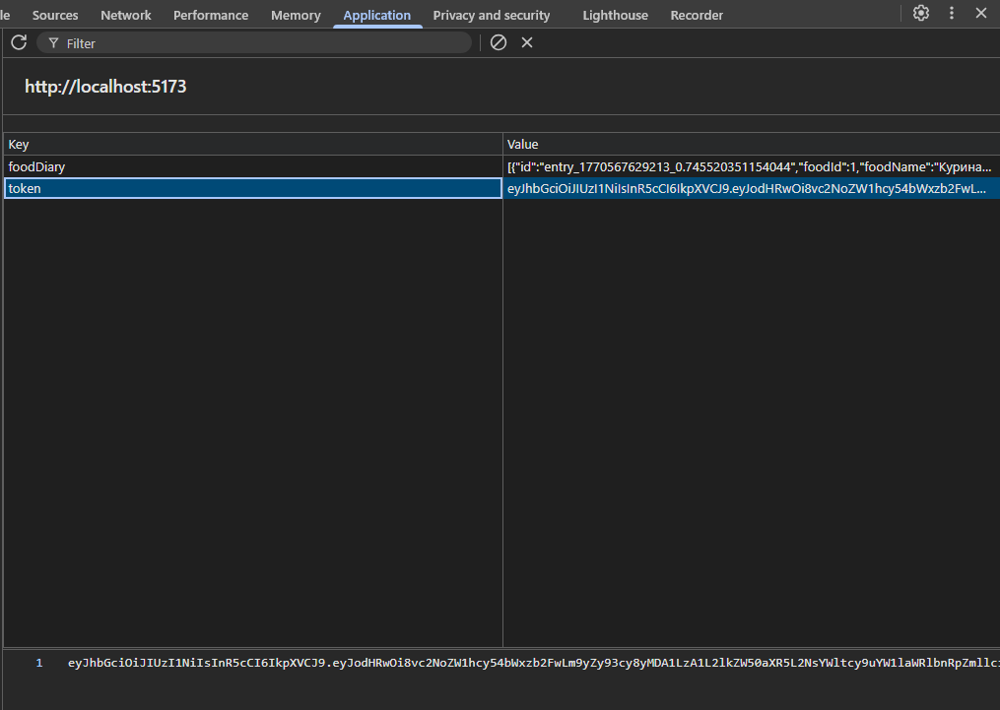

Рисунок 2.16 - Проверка запросов авторизации в инструментах разработчика

Проверка сетевых запросов подтверждает, что клиентская часть действительно обращается к backend при выполнении авторизации. Это позволяет контролировать корректность маршрутов, заголовков и формата ответа.

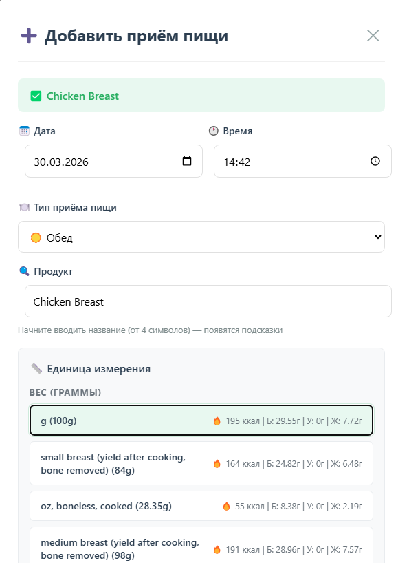

Рисунок 2.17 - Проверка формы добавления приема пищи

Проверка формы добавления приема пищи показывает корректность пользовательского сценария ввода данных. Такой сценарий важен, потому что пищевой дневник используется регулярно и должен работать предсказуемо.

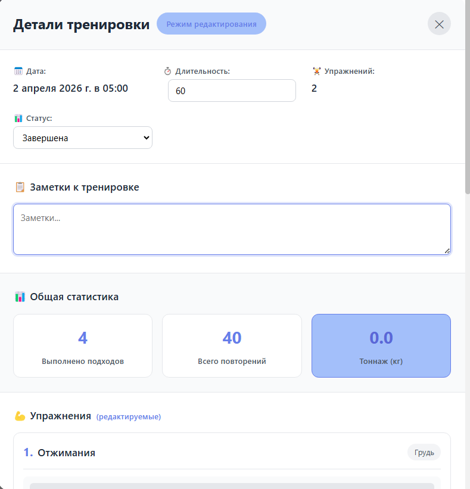

Рисунок 2.18 - Проверка детальной страницы тренировки

Детальная страница тренировки демонстрирует итоговое представление сохраненных данных. Наличие такой страницы позволяет пользователю возвращаться к ранее созданным тренировкам и анализировать выполненную нагрузку.

## 2.7 Оценка результатов разработки

Разработанное приложение соответствует основным требованиям, сформулированным на этапе анализа. Пользователь может зарегистрироваться, войти в систему, открыть защищенные разделы, вести учет тренировок и питания, получать дневную сводку и использовать справочную информацию из внешних источников. Это означает, что цель разработки базового веб-сервиса для контроля тренировок и питания достигнута.

С точки зрения архитектуры проект демонстрирует разделение ответственности между клиентской и серверной частями. Frontend отвечает за отображение интерфейса, маршрутизацию, формы и пользовательское состояние. Backend отвечает за безопасность, бизнес-логику, работу с базой данных и интеграции. Такое разделение соответствует современным подходам к разработке веб-приложений.

С точки зрения практической значимости приложение может использоваться как основа для дальнейшей разработки фитнес-сервиса. В текущем виде оно закрывает базовые сценарии индивидуального пользователя. При дальнейшем развитии можно добавить роль тренера, назначение программ тренировок, контроль выполнения, рекомендации по питанию и визуальную аналитику прогресса.

К сильным сторонам проекта можно отнести наличие полноценной серверной части, использование PostgreSQL, поддержку JWT-авторизации, интеграцию с внешними API, наличие отдельных модулей тренировок и питания, а также возможность дальнейшего расширения. Проект не ограничивается статическим интерфейсом, а содержит реальную работу с данными.

К слабым сторонам текущей версии относятся неоднородность маршрутов API, необходимость доработки сетевого слоя frontend, ограниченное количество автоматических тестов и необходимость улучшения безопасности конфигурации перед промышленным развертыванием. Эти ограничения зафиксированы как направления дальнейшего развития и не препятствуют демонстрации результата ВКР.

Фрагменты программного кода, демонстрирующие наиболее значимые части реализации, приведены в приложении А. В приложение вынесены не все исходные файлы проекта, а только показательные участки: генерация JWT-токена, хранение подходов тренировки в JSONB, защита маршрутов на клиенте и обращение к API пищевого дневника.

## 2.8 Перспективы дальнейшего развития

Первым направлением развития является расширение пользовательских ролей. Сейчас приложение ориентировано преимущественно на индивидуального пользователя. Добавление роли тренера позволит создавать программы тренировок для клиентов, отслеживать выполнение, давать рекомендации и анализировать прогресс группы пользователей.

Вторым направлением является развитие аналитики. На основе уже сохраняемых данных можно строить графики тренировочного объема, динамику веса, распределение калорий по дням, соотношение белков, жиров и углеводов, а также сравнение фактических показателей с целевыми значениями.

Третьим направлением является улучшение модуля питания. Можно добавить расчет индивидуальной нормы калорий, учет целей пользователя, шаблоны приемов пищи, избранные продукты и рецепты. Это позволит превратить пищевой дневник из простого журнала записей в инструмент планирования рациона.

Четвертым направлением является подготовка production-развертывания. Для этого необходимо вынести секреты в защищенное окружение, настроить HTTPS-сертификаты, подготовить Docker-контейнеры, настроить миграции базы данных и добавить журналирование ошибок.

Пятым направлением является повышение качества тестирования. Автоматические тесты позволят безопаснее изменять код, быстрее находить ошибки и подтверждать корректность основных сценариев перед демонстрацией или внедрением. Особенно полезны интеграционные тесты для API авторизации, тренировок и питания.

# ЗАКЛЮЧЕНИЕ

В ходе выполнения выпускной квалификационной работы было разработано веб-приложение web_health, предназначенное для учета тренировок и питания пользователя. Работа охватила основные этапы создания программного продукта: анализ предметной области, формирование требований, выбор технологического стека, проектирование архитектуры, реализацию серверной и клиентской частей, интеграцию с внешними сервисами и проверку работоспособности.

В первом разделе был выполнен анализ предметной области цифровых фитнес-сервисов. Рассмотрены существующие подходы к учету физической активности и питания, выделены ограничения бумажных дневников, таблиц и закрытых коммерческих приложений. На основе анализа сформулированы функциональные и нефункциональные требования к разрабатываемому веб-приложению.

Во втором разделе была спроектирована и реализована архитектура системы. Приложение построено по клиент-серверной модели и включает React-клиент, ASP.NET Core backend, базу данных PostgreSQL и интеграции с внешними API FatSecret и Wger. Описана структура базы данных, основные сущности, связи между ними, серверные контроллеры, клиентские маршруты и механизмы безопасности.

Поставленная цель работы достигнута: разработан работоспособный прототип веб-приложения для учета тренировок и питания. Система позволяет пользователю зарегистрироваться, войти в личный кабинет, работать с тренировками, фиксировать приемы пищи и получать справочную информацию из внешних сервисов.

Практическая значимость результата заключается в создании основы для самостоятельного фитнес-сервиса, который может быть использован как учебный проект, демонстрационный прототип или база для дальнейшей разработки. В перспективе приложение может быть дополнено ролями тренера и клиента, системой рекомендаций, графиками прогресса, уведомлениями, расширенной аналитикой, мобильной адаптацией и автоматизированным тестированием.

# СПИСОК ИСПОЛЬЗОВАННЫХ ИСТОЧНИКОВ

1. ГОСТ 7.32-2017. Отчет о научно-исследовательской работе. Структура и правила оформления.

2. ГОСТ Р 7.0.100-2018. Библиографическая запись. Библиографическое описание.

3. Методические рекомендации для подготовки и оформления выпускных квалификационных работ. Екатеринбург, 2019.

4. React. Official Documentation : сайт. URL: https://react.dev/ (дата обращения: 10.05.2026).

5. TypeScript. Documentation : сайт. URL: https://www.typescriptlang.org/docs/ (дата обращения: 10.05.2026).

6. Vite. Guide : сайт. URL: https://vite.dev/guide/ (дата обращения: 10.05.2026).

7. Redux Toolkit. Documentation : сайт. URL: https://redux-toolkit.js.org/ (дата обращения: 10.05.2026).

8. React Router. Documentation : сайт. URL: https://reactrouter.com/ (дата обращения: 10.05.2026).

9. Axios. Documentation : сайт. URL: https://axios-http.com/ (дата обращения: 10.05.2026).

10. Microsoft. ASP.NET Core documentation : сайт. URL: https://learn.microsoft.com/aspnet/core/ (дата обращения: 10.05.2026).

11. Microsoft. Authentication and authorization in ASP.NET Core : сайт. URL: https://learn.microsoft.com/aspnet/core/security/authentication/ (дата обращения: 10.05.2026).

12. Microsoft. SignalR documentation : сайт. URL: https://learn.microsoft.com/aspnet/core/signalr/ (дата обращения: 10.05.2026).

13. Microsoft. Entity Framework Core documentation : сайт. URL: https://learn.microsoft.com/ef/core/ (дата обращения: 10.05.2026).

14. PostgreSQL. Official Documentation : сайт. URL: https://www.postgresql.org/docs/ (дата обращения: 10.05.2026).

15. Npgsql Entity Framework Core Provider : сайт. URL: https://www.npgsql.org/efcore/ (дата обращения: 10.05.2026).

16. JSON Web Token (JWT). RFC 7519 : сайт. URL: https://www.rfc-editor.org/rfc/rfc7519 (дата обращения: 10.05.2026).

17. OWASP. JSON Web Token Cheat Sheet : сайт. URL: https://cheatsheetseries.owasp.org/cheatsheets/JSON_Web_Token_for_Java_Cheat_Sheet.html (дата обращения: 10.05.2026).

18. BCrypt.Net documentation and repository : сайт. URL: https://github.com/BcryptNet/bcrypt.net (дата обращения: 10.05.2026).

19. AutoMapper. Documentation : сайт. URL: https://docs.automapper.org/ (дата обращения: 10.05.2026).

20. Swashbuckle.AspNetCore. Documentation : сайт. URL: https://github.com/domaindrivendev/Swashbuckle.AspNetCore (дата обращения: 10.05.2026).

21. FatSecret Platform API. Documentation : сайт. URL: https://platform.fatsecret.com/api/ (дата обращения: 10.05.2026).

22. Wger Workout Manager API. Documentation : сайт. URL: https://wger.de/en/software/api (дата обращения: 10.05.2026).

23. MDN Web Docs. HTTP : сайт. URL: https://developer.mozilla.org/docs/Web/HTTP (дата обращения: 10.05.2026).

24. MDN Web Docs. CORS : сайт. URL: https://developer.mozilla.org/docs/Web/HTTP/CORS (дата обращения: 10.05.2026).

25. Git. Documentation : сайт. URL: https://git-scm.com/doc (дата обращения: 10.05.2026).

26. GitHub Docs : сайт. URL: https://docs.github.com/ (дата обращения: 10.05.2026).

27. WebHealthServer и web-health-service. Исходный код проекта web_health. Локальный репозиторий автора, 2026.

# ПРИЛОЖЕНИЕ А (справочное) Листинги программного кода

В приложении приведены фрагменты исходного кода, отражающие ключевые технические решения проекта web_health. Листинги не содержат полный исходный код приложения, так как полный проект включает большое количество файлов клиентской и серверной частей. Для пояснительной записки выбраны участки, которые демонстрируют авторизацию, хранение тренировочных подходов, защиту клиентских маршрутов и работу с API пищевого дневника.

Листинг А.1 демонстрирует формирование JWT-токена на серверной стороне. В токен добавляются основные сведения о пользователе: идентификатор, email, имя и роль. Эти данные затем используются сервером для определения текущего пользователя при обращении к защищенным методам API.

```csharp
public string GenerateToken(Client user)
{
    var claims = new[]
    {
        new Claim(ClaimTypes.NameIdentifier, user.Id.ToString()),
        new Claim(ClaimTypes.Email, user.Email),
        new Claim(ClaimTypes.Name, user.FirstName),
        new Claim(ClaimTypes.Role, user.Role.ToString())
    };

    var keyBytes = Convert.FromBase64String(_configuration["Jwt:Key"]);
    var key = new SymmetricSecurityKey(keyBytes);
    var creds = new SigningCredentials(key, SecurityAlgorithms.HmacSha256);

    var token = new JwtSecurityToken(
        issuer: _configuration["Jwt:Issuer"],
        audience: _configuration["Jwt:Audience"],
        claims: claims,
        expires: DateTime.Now.AddMinutes(
            Convert.ToDouble(_configuration["Jwt:ExpireMinutes"])),
        signingCredentials: creds);

    return new JwtSecurityTokenHandler().WriteToken(token);
}
```

Данный фрагмент относится к сервису `JwtService`. Он показывает, каким образом backend формирует подписанный токен, используемый клиентским приложением для последующих запросов к защищенным ресурсам.

Листинг А.2 показывает модель упражнения внутри тренировочной сессии. Особенностью реализации является хранение списка подходов в поле `SetsJson` с типом `jsonb`. При сохранении подходов дополнительно пересчитываются агрегированные показатели нагрузки.

```csharp
public class WorkoutSessionExercise : AbstractEntity
{
    public int WorkoutSessionId { get; set; }
    public WorkoutSession WorkoutSession { get; set; }

    public int ExerciseId { get; set; }
    public Exercise Exercise { get; set; }

    [Column(TypeName = "jsonb")]
    public string SetsJson { get; set; } = "[]";

    public int CompletedSets { get; set; }
    public int TotalReps { get; set; }
    public decimal TotalTonnage { get; set; }

    public List<WorkoutSetDto> GetSets()
    {
        if (string.IsNullOrEmpty(SetsJson))
            return new List<WorkoutSetDto>();

        return JsonSerializer.Deserialize<List<WorkoutSetDto>>(SetsJson)
            ?? new List<WorkoutSetDto>();
    }

    public void SetSets(List<WorkoutSetDto> sets)
    {
        SetsJson = JsonSerializer.Serialize(sets);
        RecalculateAggregates(sets);
    }

    private void RecalculateAggregates(List<WorkoutSetDto> sets)
    {
        var completedSets = sets.Where(s => s.Completed).ToList();

        CompletedSets = completedSets.Count;
        TotalReps = completedSets.Sum(s => s.Reps);
        TotalTonnage = completedSets.Sum(s => s.Reps * s.WeightKg);
    }
}
```

Этот листинг связан с модулем тренировок. Он показывает, что приложение хранит не только сам список подходов, но и итоговые показатели, необходимые для отображения тренировочной нагрузки и дальнейшего развития аналитики.

Листинг А.3 демонстрирует защиту маршрутов на клиентской стороне. Компонент проверяет наличие токена в Redux-состоянии и в `localStorage`. Если пользователь не авторизован, выполняется перенаправление на страницу входа.

```tsx
interface Props {
  children: React.ReactNode;
}

export const PrivateRoute: React.FC<Props> = ({ children }) => {
  const isAuthenticated = useSelector(
    (state: RootState) => state.auth.token !== null
  );

  const hasToken = !!localStorage.getItem("token");

  if (!isAuthenticated || !hasToken) {
    return <Navigate to="/Auth/Login" replace />;
  }

  return <>{children}</>;
};
```

Клиентская проверка не заменяет серверную авторизацию, но улучшает пользовательский сценарий: неавторизованный пользователь не видит защищенные страницы и сразу перенаправляется к форме входа.

Листинг А.4 показывает фрагмент API-сервиса пищевого дневника на клиентской стороне. Функция формирует заголовки авторизации и выполняет запрос на получение дневной сводки по выбранной дате.

```typescript
const API_BASE = "/api/MealEntries";

const getAuthHeaders = () => {
  const token = localStorage.getItem("token");

  return {
    "Content-Type": "application/json",
    ...(token ? { Authorization: `Bearer ${token}` } : {})
  };
};

export const foodLogApi = {
  getDailySummary: async (date: string): Promise<DailySummaryDto> => {
    const response = await fetch(`${API_BASE}/summary?date=${date}`, {
      method: "GET",
      headers: getAuthHeaders()
    });

    if (!response.ok) {
      const error = await response.json().catch(() => ({}));
      throw new Error(error.error || "Failed to fetch daily summary");
    }

    return response.json();
  }
};
```

Данный фрагмент показывает взаимодействие frontend с backend в модуле питания. По аналогичному принципу реализованы запросы получения записей за дату, добавления, обновления и удаления записей пищевого дневника.

Приведенные листинги подтверждают, что в проекте реализованы не только экранные формы, но и основные программные механизмы: авторизация, защита маршрутов, хранение тренировочных данных и обмен с серверным API.

